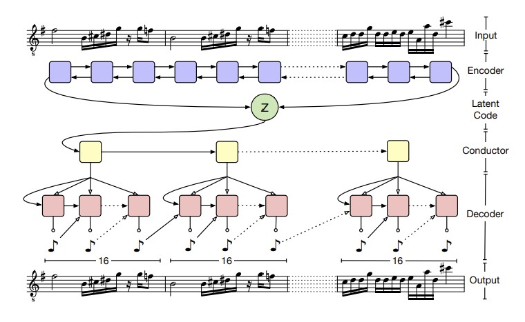
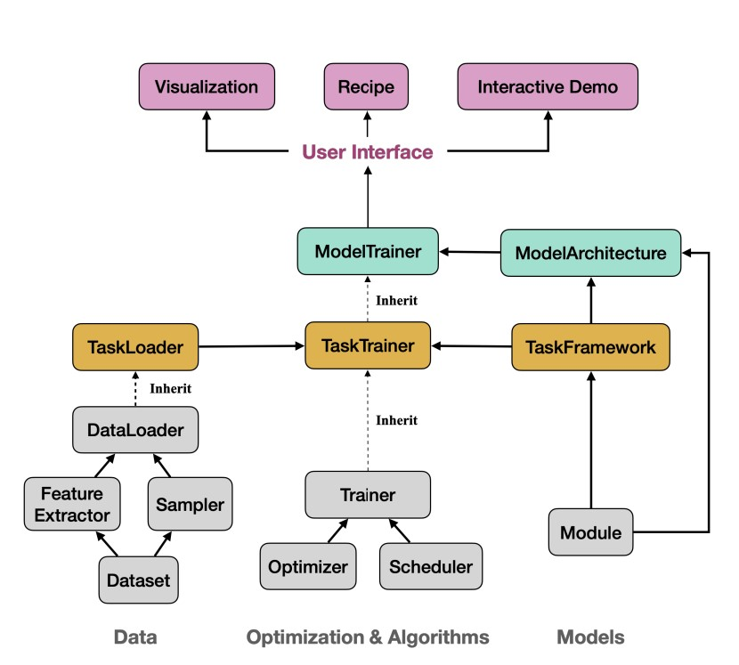
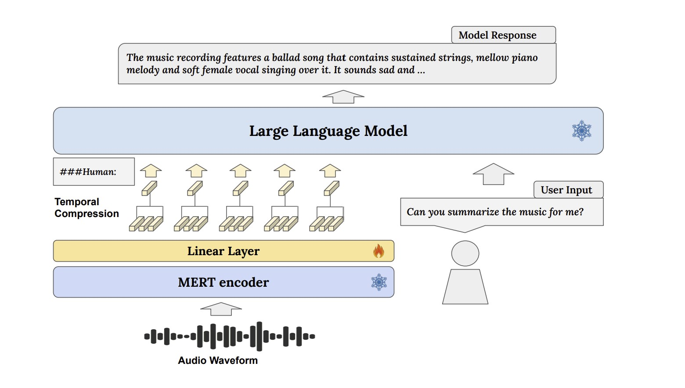

# Retrograde Chronicle of Generative Music Intelligence Evolution

---

## About

This repository is maintained by [Joseph Chay](https://github.com/josephchay) presenting collected comprehensive and
influential works of resources that are related to the field of music generation. 
The resources are organized in a reverse chronological order, starting from the most recent to the earliest.

## Table of Contents

  - [Algorithmic Composition](#algorithmic-composition)
     - [2018](#2018)
     - [2015](#2015)
     - [2009](#2009)
     - [2000](#2000)
     - [1992](#1992)
     - [1989](#1989)
     - [1959](#1959)
  - [Deep Learning Models for Symbolic Music Generation](#deep-learning-models-for-symbolic-music-generation)
    - [2023](#2023)
    - [2022](#2022)
    - [2021](#2021)
    - [2020](#2020)
    - [2019](#2019)
    - [2018](#2018)
    - [2017](#2017)
    - [2016](#2016)
    - [2002](#2002)
    - [1990s](#1990s)
  - [Audio Generation](#audio-generation)
    - [2023](#2023-1)
    - [2022](#2022-1)
    - [2021](#2021-1)
    - [2020](#2020-1)
    - [2017](#2017-1)
  - [Textual Contexts & Language Model Integration](#textual-contexts--language-models-integration)
  - [Evaluation Methodologies](#evaluation-methodologies)
    - [2023](#2023-2)

## Resources

---

### Algorithmic Composition

#### 2018

1. The Oxford Handbook of Algorithmic Music
   - McLean, A., & Dean, R. T. (Eds.). (2018). The Oxford handbook of algorithmic music. Oxford University Press.
   [Book Digital Copy](https://api.pageplace.de/preview/DT0400.9780190227005_A35478151/preview-9780190227005_A35478151.pdf)

#### 2015

1. Fundamentals of Music Processing
   - Müller, M. (2015). Fundamentals of music processing: Audio, analysis, algorithms, applications. Springer.
   [Book Digital Copy](https://link.springer.com/book/10.1007/978-3-319-21945-5)

#### 2009

1. Paradigms of Automated Music Generation
   - Nierhaus, G. (2009). Algorithmic composition: paradigms of automated music generation. Springer Science & Business Media.
   [Book Digital Copy (Request)](https://link.springer.com/book/10.1007/978-3-211-75540-2)

#### 2000

1. The Algorithmic Composer
   - Cope, D. (2000). The algorithmic composer (Vol. 16). AR Editions, Inc..
   [Book Digital Copy (Request)](https://www.researchgate.net/publication/209436329_The_Algorithmic_Composer)

#### 1992

1. HARMONET
   - Hild, H., Feulner, J., & Menzel, W. (1992). HARMONET: A neural net for harmonizing chorales in the style of JS Bach. 
   In Advances in neural information processing systems (pp. 267-274).
   [Paper](https://proceedings.neurips.cc/paper/1991/file/a7aeed74714116f3b292a982238f83d2-Paper.pdf)

#### 1989

1. A connectionist approach to algorithmic composition
   - Todd, P. M. (1989). A connectionist approach to algorithmic composition. Computer Music Journal, 13(4), 27-43.
   [Book Digital Copy](https://abcwest.sitehost.iu.edu/pmwiki/pdf/todd.compmusic.1989.pdf)

#### 1959

1. Experimental Music
   - Westergaard, P. (1959). Experimental Music. Composition with an Electronic Computer. 
   [Book Digital Copy](https://ia803209.us.archive.org/21/items/experimentalmusi00hill/experimentalmusi00hill.pdf)

---

[🡹 Back to Table of Contents 🡹](#table-of-contents)

---

### Deep Learning Models for Symbolic Music Generation

#### 2024

1. Non-Differentiable Rule Guided Diffusion
   - 
   Huang, Y., Ghatare, A., Liu, Y., Hu, Z., Zhang, Q., Sastry, C. S., Gururani, S., Oore, S., & Yue, Y. (2024, February 22). 
   Symbolic Music Generation with Non-Differentiable Rule Guided Diffusion. arXiv.org.
   [Paper](https://arxiv.org/abs/2402.14285) 

#### 2023

1. RL-Chord
   - Ji, S., Yang, X., Luo, J., & Li, J. (2023). RL-Chord: CLSTM-Based Melody Harmonization Using Deep Reinforcement Learning. 
   IEEE Transactions on Neural Networks and Learning Systems. [Paper](https://ieeexplore.ieee.org/abstract/document/10063204)

2. FIGRARO
   - 
   von Rütte, D., Biggio, L., Kilcher, Y., & Hoffman, T. (2022). FIGARO: Generating Symbolic Music with Fine-Grained Artistic Control. 
   Accepted ICLR 2023. [Paper](https://arxiv.org/pdf/2201.10936v3)

#### 2022

1. Museformer
   - Yu, B., Lu, P., Wang, R., Hu, W., Tan, X., Ye, W., ... & Liu, T. Y. (2022). 
   Museformer: Transformer with Fine-and Coarse-Grained Attention for Music Generation. NIPS 2022.
   [Paper](https://openreview.net/forum?id=GFiqdZOm-Ei) • [NIPS Presentation](https://nips.cc/virtual/2022/poster/54604)

2. Bar Transformer 
   - Qin, Y., Xie, H., Ding, S., Tan, B., Li, Y., Zhao, B., & Ye, M. (2022). 
   Bar transformer: a hierarchical model for learning long-term structure and generating impressive pop music. Applied Intelligence, 1-19.
   [Paper](https://link.springer.com/article/10.1007/s10489-022-04049-3)

3. Symphony Generation with Permutation Invariant Language Model
   - 
   Liu, J., Dong, Y., Cheng, Z., Zhang, X., Li, X., Yu, F., & Sun, M. (2022). 
   Symphony Generation with Permutation Invariant Language Model.
   [Paper](https://arxiv.org/pdf/2205.05448) • [Code](https://github.com/symphonynet/SymphonyNet) •
   [Samples](https://symphonynet.github.io/)

4. Theme Transformer
   - 
   Shih, Y. J., Wu, S. L., Zalkow, F., Muller, M., & Yang, Y. H. (2022). 
   Theme Transformer: Symbolic Music Generation with Theme-Conditioned Transformer. 
   IEEE Transactions on Multimedia. 
   [Paper](https://arxiv.org/abs/2111.04093) • [GitHub](https://github.com/atosystem/ThemeTransformer)

#### 2021

1. Compound Word Transformer 
   - Hsiao, W. Y., Liu, J. Y., Yeh, Y. C., & Yang, Y. H. (2021, May). Compound word transformer: 
   Learning to compose full-song music over dynamic directed hypergraphs. 
   In Proceedings of the AAAI Conference on Artificial Intelligence (Vol. 35, No. 1, pp. 178-186).
   [Paper](https://ojs.aaai.org/index.php/AAAI/article/view/16091) •
   [GitHub](https://github.com/YatingMusic/compound-word-transformer)

2. Melody Generation from Lyrics
   - 
   Yu, Y., Srivastava, A., & Canales, S. (2021). Conditional lstm-gan for melody generation from lyrics. 
   ACM Transactions on Multimedia Computing, Communications, and Applications (TOMM), 17(1), 1-20.
   [Paper](https://dl.acm.org/doi/abs/10.1145/3424116)

3. Music Generation with Diffusion Models
   - 
   Mittal, G., Engel, J., Hawthorne, C., & Simon, I. (2021). 
   Symbolic music generation with diffusion models. arXiv preprint arXiv:2103.16091.
   [Paper](https://arxiv.org/abs/2103.16091) • [GitHub](https://github.com/magenta/symbolic-music-diffusion)

4. Reviews
   - Hernandez-Olivan, C., & Beltran, J. R. (2021). Music composition with deep learning: A review. 
   arXiv preprint arXiv:2108.12290.
   [Paper](https://arxiv.org/abs/2108.12290)

#### 2020

1. Pop Music Transformer
   - Huang, Y. S., & Yang, Y. H. (2020, October). Pop music transformer:
   Beat-based modeling and generation of expressive pop piano compositions. 
   In Proceedings of the 28th ACM International Conference on Multimedia (pp. 1180-1188).
   [Paper](https://dl.acm.org/doi/abs/10.1145/3394171.3413671) • [GitHub](https://github.com/YatingMusic/remi)

2. Controllable Polyphonic Music Generation
   - 
   Wang, Z., Wang, D., Zhang, Y., & Xia, G. (2020). Learning interpretable representation for controllable polyphonic music generation. 
   arXiv preprint arXiv:2008.07122.
   [Paper](https://arxiv.org/abs/2008.07122) • [Web](https://program.ismir2020.net/poster_5-05.html) • [Video](https://www.youtube.com/watch?v=Sb6jXP_7dtE&t=28s&ab_channel=ISMIR2020)

3. Multitrack Music Generation 
   - 
   Ens, J., & Pasquier, P. (2020). Mmm: Exploring conditional multi-track music generation with the transformer. 
   arXiv preprint arXiv:2008.06048.
   [Paper](https://arxiv.org/abs/2008.06048) • [Web](https://jeffreyjohnens.github.io/MMM/) • [Colab](https://colab.research.google.com/drive/1xGZW3GP24HUsxnbebqfy1iCyYySQ64Vs?usp=sharing) [Github (AI Guru)](https://github.com/AI-Guru/MMM-JSB)

4. Transformer-XL
   - 
   Wu, X., Wang, C., & Lei, Q. (2020). Transformer-XL Based Music Generation with Multiple Sequences of Time-valued Notes. 
   arXiv preprint arXiv:2007.07244. [Paper](https://arxiv.org/abs/2007.07244)

5. Transformer VAE
   - 
   Jiang, J., Xia, G. G., Carlton, D. B., Anderson, C. N., & Miyakawa, R. H. (2020, May). Transformer vae: A hierarchical model for structure-aware and interpretable music representation learning. 
   In ICASSP 2020-2020 IEEE International Conference on Acoustics, Speech and Signal Processing (ICASSP) (pp. 516-520). IEEE.
   [Paper](https://ieeexplore.ieee.org/document/9054554)

6. Deep Learning Techniques for Music Generation 
   - Briot, J. P., Hadjeres, G., & Pachet, F. (2020). Deep learning techniques for music generation (pp. 1-249). Springer.
   [Book Digital Copy](https://www.researchgate.net/profile/Jean-Pierre-Briot/publication/333014972_Deep_Learning_Techniques_for_Music_Generation_-_A_Survey/links/61771cb6a767a03c14b4d6f0/Deep-Learning-Techniques-for-Music-Generation-A-Survey.pdf)

7. Reviews
   - Ji, S., Luo, J., & Yang, X. (2020). A Comprehensive Survey on Deep Music Generation: Multi-level Representations, Algorithms, Evaluations, and Future Directions. arXiv preprint arXiv:2011.06801.
   [Paper](https://arxiv.org/abs/2011.06801)

#### 2019

1. TonicNet
   - 
   Peracha, O. (2019). Improving polyphonic music models with feature-rich encoding. arXiv preprint arXiv:1911.11775.
   [Paper](https://arxiv.org/abs/1911.11775)

2. LakhNES
   - 
   Donahue, C., Mao, H. H., Li, Y. E., Cottrell, G. W., & McAuley, J. (2019). 
   LakhNES: Improving multi-instrumental music generation with cross-domain pre-training. arXiv preprint arXiv:1907.04868.
   [Paper](https://arxiv.org/abs/1907.04868)

3. R-Transformer
   - 
   Wang, Z., Ma, Y., Liu, Z., & Tang, J. (2019). R-transformer: Recurrent neural network enhanced transformer. 
   arXiv preprint arXiv:1907.05572.
   [Paper](https://arxiv.org/abs/1907.05572)

4. Maia Music Generator
   - 
   [Web](https://maia.music.blog/2019/05/13/maia-a-new-music-generator/)

5. Coconet: Counterpoint by Convolution 
   - 
   Huang, C. Z. A., Cooijmans, T., Roberts, A., Courville, A., & Eck, D. (2019). Counterpoint by convolution. arXiv preprint arXiv:1903.07227.
   [Paper](https://arxiv.org/abs/1903.07227) • [Web](https://coconets.github.io/)

6. Reviews
   - Briot, J. P., Hadjeres, G., & Pachet, F. D. (2017). Deep learning techniques for music generation--a survey. arXiv preprint arXiv:1709.01620.
   [Paper](https://arxiv.org/abs/1709.01620)

#### 2018

1. Music Transformer - Google Magenta
   - 
   
   Huang, C. Z. A., Vaswani, A., Uszkoreit, J., Shazeer, N., Simon, I., Hawthorne, et al. (2018). 
   Music transformer. arXiv preprint arXiv:1809.04281.
   [Web](https://magenta.tensorflow.org/music-transformer) • [Paper](https://arxiv.org/pdf/1809.04281.pdf)

2. Imposing Higher-Level Structure in Polyphonic Music
   - 
   Lattner, S., Grachten, M., & Widmer, G. (2018). Imposing higher-level structure in polyphonic music generation using convolutional restricted boltzmann machines and constraints. 
   Journal of Creative Music Systems, 2, 1-31.
   [Paper](https://arxiv.org/pdf/1612.04742.pdf)

3. MusicVAE - Google Magenta
   - 
   Roberts, A., Engel, J., Raffel, C., Hawthorne, C., & Eck, D. (2018, July). 
   A hierarchical latent vector model for learning long-term structure in music. In International Conference on Machine Learning (pp. 4364-4373). PMLR.
   [Web](https://magenta.tensorflow.org/music-vae) • [Paper](https://arxiv.org/pdf/1803.05428.pdf) 
   [Code](https://github.com/tensorflow/magenta/tree/master/magenta/models/music_vae) • [Google Colab](https://colab.research.google.com/notebooks/magenta/music_vae/music_vae.ipynb) [Explanation](https://medium.com/@musicvaeubcse/musicvae-understanding-of-the-googles-work-for-interpolating-two-music-sequences-621dcbfa307c)

#### 2017

1. MorpheuS
   - 
   Herremans, D., & Chew, E. (2017). MorpheuS: generating structured music with constrained patterns and tension. 
   IEEE Transactions on Affective Computing, 10(4), 510-523.
   [Paper](https://arxiv.org/pdf/1812.04832.pdf)

2. Polyphonic GAN
   - 
   
   Lee, S. G., Hwang, U., Min, S., & Yoon, S. (2017). Polyphonic music generation with sequence generative adversarial networks. 
   arXiv preprint arXiv:1710.11418. [Paper](https://arxiv.org/abs/1710.11418)

3. Bachbot - Microsoft
   - 
   Liang, F. T., Gotham, M., Johnson, M., & Shotton, J. (2017, October). 
   Automatic Stylistic Composition of Bach Chorales with Deep LSTM. In ISMIR (pp. 449-456).
   [Paper](https://www.microsoft.com/en-us/research/publication/automatic-stylistic-composition-of-bach-chorales-with-deep-lstm/) •
   [Liang Master Thesis 2016](https://www.mlmi.eng.cam.ac.uk/files/feynman_liang_8224771_assignsubmission_file_liangfeynmanthesis.pdf)

4. MuseGAN
   - 
   
   
   Dong, H. W., Hsiao, W. Y., Yang, L. C., & Yang, Y. H. (2018, April). 
   Musegan: Multi-track sequential generative adversarial networks for symbolic music generation and accompaniment. In Proceedings of the AAAI Conference on Artificial Intelligence (Vol. 32, No. 1).
   [Web](https://salu133445.github.io/musegan/) • [Paper](https://arxiv.org/pdf/1709.06298.pdf) • [GitHub](https://github.com/salu133445/musegan)

5. Composing Music with LSTM
   - 
   Johnson, D. D. (2017, April). Generating polyphonic music using tied parallel networks. 
   In International conference on evolutionary and biologically inspired music and art (pp. 128-143). Springer, Cham.
   [Paper](https://link.springer.com/chapter/10.1007/978-3-319-55750-2_9) • [Web](https://www.danieldjohnson.com/2015/08/03/composing-music-with-recurrent-neural-networks/) [GitHub](https://github.com/danieldjohnson/biaxial-rnn-music-composition) [Blog](https://www.danieldjohnson.com/2015/08/03/composing-music-with-recurrent-neural-networks/)

6. ORGAN
   - 
   Guimaraes, G. L., Sanchez-Lengeling, B., Outeiral, C., Farias, P. L. C., & Aspuru-Guzik, A. (2017). 
   Objective-reinforced generative adversarial networks (ORGAN) for sequence generation models. 
   arXiv preprint arXiv:1705.10843.
   [Paper](https://arxiv.org/abs/1705.10843)

7. MidiNet
   - 
   Yang, L. C., Chou, S. Y., & Yang, Y. H. (2017). MidiNet: A convolutional generative adversarial network for symbolic-domain music generation. 
   arXiv preprint arXiv:1703.10847.
   [Paper](https://arxiv.org/abs/1703.10847)

#### 2016

1. DeepBack
   - 
   Hadjeres, G., Pachet, F., & Nielsen, F. (2017, July). Deepbach: a steerable model for bach chorales generation. 
   In International Conference on Machine Learning (pp. 1362-1371). PMLR.
   [Web](http://www.flow-machines.com/history/projects/deepbach-polyphonic-music-generation-bach-chorales/) 
   [Paper](https://arxiv.org/pdf/1612.01010.pdf) • [Code](https://github.com/Ghadjeres/DeepBach)

2. Fine-Tuning with RL
   - 
   Jaques, N., Gu, S., Turner, R. E., & Eck, D. (2016). Generating music by fine-tuning recurrent neural networks with reinforcement learning.
   [Paper](https://research.google/pubs/pub45871/)

3. C-RNN-GAN
   - 
   Mogren, O. (2016). C-RNN-GAN: Continuous recurrent neural networks with adversarial training. 
   arXiv preprint arXiv:1611.09904.
   [Paper](https://arxiv.org/abs/1611.09904)

4. SeqGAN
   - 
   Yu, L., Zhang, W., Wang, J., & Yu, Y. (2017, February). 
   Seqgan: Sequence generative adversarial nets with policy gradient. In Proceedings of the AAAI conference on artificial intelligence (Vol. 31, No. 1).
   [Paper](https://arxiv.org/abs/1609.05473)

#### 2002

1. Temporal Structure in Music
   - Eck, D., & Schmidhuber, J. (2002, September). Finding temporal structure in music: Blues improvisation with LSTM recurrent networks. 
   In Proceedings of the 12th IEEE workshop on neural networks for signal processing (pp. 747-756). IEEE.
   [Paper](https://ieeexplore.ieee.org/document/1030094)

#### 1990s

1. Neural Network Music Composition
   - Mozer, M. C. (1994). Neural network music composition by prediction: Exploring the benefits of psychoacoustic constraints and multi-scale processing. Connection Science, 6(2-3), 247-280.
   [Paper](https://www.tandfonline.com/doi/abs/10.1080/09540099408915726)

---

[🡹 Back to Table of Contents 🡹](#table-of-contents)

---

### Audio Generation

#### 2024

1 Amphion
   - 
   
   Zhang, X., Xue, L., Gu, Y., Wang, Y., Li, J., He, H., ... (2023, December 15). 
   Amphion: An Open-Source Audio, Music and Speech Generation Toolkit. arXiv.org.
   [Paper](https://arxiv.org/search/?query=music+generation&searchtype=all&abstracts=show&order=-announced_date_first&size=50&start=400) •
   [GitHub](https://github.com/open-mmlab/Amphion)

1. Mustango
   - [!image](images/Mustango.jpg)
   Melechovsky, J., Guo, Z., Ghosal, D., Majumder, N., Herremans, D., & Poria, S. (2023, November 14). 
   Mustango: Toward Controllable Text-to-Music Generation. arXiv.org.
   [Paper](https://arxiv.org/abs/2311.08355) • [GitHub](https://github.com/AMAAI-Lab/mustango) • [Demo & Dataset](https://huggingface.co/spaces/declare-lab/mustango)

#### 2023

1. Music ControlNet
   - 
   Wu, S., Donahue, C., Watanabe, S., & Bryan, N. J. (2023, November 13).
   Music ControlNet: Multiple Time-varying Controls for Music Generation. arXiv.org. 
   [Paper](https://arxiv.org/abs/2311.07069) • [Sample](https://musiccontrolnet.github.io/web/) • [Video](https://www.youtube.com/watch?v=QVr-S-DyccU)

1. JEN-1 Composer
   - 
   Yao, Y., Li, P., Chen, B., & Wang, A. (2023, October 29). JEN-1 Composer: 
   A Unified Framework for High-Fidelity Multi-Track Music Generation. arXiv.org. 
   [Paper](https://arxiv.org/abs/2310.19180)

1. Music Understanding LLaMA
   - 
   - 
   Liu, S., Hussain, A. S., Sun, C., & Shan, Y. (2023, August 22). Music Understanding LLaMA: Advancing Text-to-Music Generation with Question Answering and Captioning. arXiv.org.
   [Paper](https://arxiv.org/abs/2308.11276)

1. AudioLDM2
   Liu, H., Yuan, Y., Liu, X., Mei, X., Kong, Q., Tian, Q., Wang, Y., Wang, W., Wang, Y., & Plumbley, M. D. (2023, August 10).
   AudioLDM 2: Learning Holistic Audio Generation with Self-supervised Pretraining. arXiv.org.
   [Paper](https://arxiv.org/abs/2308.05734) • [Samples](https://audioldm.github.io/audioldm2/) • [GitHub](https://github.com/haoheliu/audioldm2)

1. JEN-1
   - 
   
   Li, P., Chen, B., Yao, Y., Wang, Y., Wang, A., & Wang, A. (2023, August 9). 
   JEN-1: Text-Guided Universal Music Generation with Omnidirectional Diffusion Models. arXiv.org.
   [Paper](https://arxiv.org/abs/2308.04729) • [Samples](https://www.jenmusic.ai/research)

1. MusiCLDM
   - 
   - 
   Chen, K., Wu, Y., Liu, H., Nezhurina, M., Berg-Kirkpatrick, T., & Dubnov, S. (2023, August 3). 
   MusicLDM: Enhancing Novelty in Text-to-Music Generation Using Beat-Synchronous Mixup Strategies. arXiv.org. 
   [Paper](https://arxiv.org/abs/2308.01546)

1. High-Fidelity Multi-Band Diffusion
   - 
   Roman, R. S., Adi, Y., Deleforge, A., Serizel, R., Synnaeve, G., & Défossez, A. (2023, August 2). 
   From Discrete Tokens to High-Fidelity Audio Using Multi-Band Diffusion. arXiv.org. 
   [Paper](https://arxiv.org/abs/2308.02560)

2. VALL-E-X
   - 
   Zhang, Z., Zhou, L., Wang, C., Chen, S., Wu, Y., Liu, S., ... & Wei, F. (2023). 
   Speak Foreign Languages with Your Own Voice: Cross-Lingual Neural Codec Language Modeling. arXiv preprint arXiv:2303.03926.
   [Paper](https://arxiv.org/abs/2303.03926)

3. ERNIE-Music
   - 
   Zhu, P., Pang, C., Wang, S., Chai, Y., Sun, Y., Tian, H., & Wu, H. (2023). 
   ERNIE-Music: Text-to-Waveform Music Generation with Diffusion Models. arXiv preprint arXiv:2302.04456.
   [Paper](https://arxiv.org/abs/2302.04456)

4. Multi-Source Diffusion Models
   - 
   Mariani, G., Tallini, I., Postolache, E., Mancusi, M., Cosmo, L., & Rodolà, E. (2023). 
   Multi-Source Diffusion Models for Simultaneous Music Generation and Separation. arXiv preprint arXiv:2302.02257.
   [Paper](https://arxiv.org/abs/2302.02257) • [Samples](https://gladia-research-group.github.io/multi-source-diffusion-models/)

5. SingSong
   - 
   Donahue, C., Caillon, A., Roberts, A., Manilow, E., Esling, P., Agostinelli, A., ... & Engel, J. (2023). SingSong: Generating musical accompaniments from singing. arXiv preprint arXiv:2301.12662.
   [Paper](https://arxiv.org/abs/2301.12662) • [Samples](https://storage.googleapis.com/sing-song/index.html)

6. AudioLDM
   - 
   Liu, H., Chen, Z., Yuan, Y., Mei, X., Liu, X., Mandic, D., ... & Plumbley, M. D. (2023). 
   AudioLDM: Text-to-Audio Generation with Latent Diffusion Models. arXiv preprint arXiv:2301.12503.
   [Paper](https://arxiv.org/abs/2301.12503) • [Samples](https://audioldm.github.io/) [GitHub] (https://github.com/haoheliu/AudioLDM)

7. Mousai
   - 
   
   
   
   Schneider, F., Jin, Z., & Schölkopf, B. (2023). Mo\^ usai: Text-to-Music Generation with Long-Context Latent Diffusion. 
   arXiv preprint arXiv:2301.11757.
   [Paper](https://arxiv.org/abs/2301.11757)

8. Make-An-Audio
   - 
   Huang, R., Huang, J., Yang, D., Ren, Y., Liu, L., Li, M., ... & Zhao, Z. (2023). 
   Make-An-Audio: Text-To-Audio Generation with Prompt-Enhanced Diffusion Models. arXiv preprint arXiv:2301.12661.
   [Paper](https://arxiv.org/abs/2301.12661) • [Samples](https://text-to-audio.github.io/)

9. Noise2Music
   - 
   Huang, Q., Park, D. S., Wang, T., Denk, T. I., Ly, A., Chen, N., ... & Han, W. (2023). 
   Noise2Music: Text-conditioned Music Generation with Diffusion Models. arXiv preprint arXiv:2302.03917.
   [Paper](https://arxiv.org/abs/2302.03917) • [Samples](https://google-research.github.io/noise2music/)

10. Msanii
   - 
   Maina, K. (2023). Msanii: High Fidelity Music Synthesis on a Shoestring Budget. arXiv preprint arXiv:2301.06468.
   [Paper](https://arxiv.org/abs/2301.06468)

11. MusicLM
   - 
   Agostinelli, A., Denk, T. I., Borsos, Z., Engel, J., Verzetti, M., Caillon, A., ... & Frank, C. (2023). 
   Musiclm: Generating music from text. arXiv preprint arXiv:2301.11325.
   [Paper](https://arxiv.org/abs/2301.11325) • [Samples](https://google-research.github.io/seanet/musiclm/examples/) 
   [Dataset](https://www.kaggle.com/datasets/googleai/musiccaps)

#### 2022

1. Musika
   - 
   
   Pasini, M., & Schlüter, J. (2022). Musika! Fast Infinite Waveform Music Generation. arXiv preprint arXiv:2208.08706.
   [Paper](https://arxiv.org/abs/2208.08706)

2. AudioLM
   - 
   Borsos, Z., Marinier, R., Vincent, D., Kharitonov, E., Pietquin, O., Sharifi, M., ... & Zeghidour, N. (2022). 
   Audiolm: a language modeling approach to audio generation. arXiv preprint arXiv:2209.03143.
   [Paper](https://arxiv.org/abs/2209.03143) • [Samples](https://google-research.github.io/seanet/audiolm/examples/)

#### 2021

1. RAVE
   - 
   Caillon, A., & Esling, P. (2021). RAVE: A variational autoencoder for fast and high-quality neural audio synthesis. 
   arXiv preprint arXiv:2111.05011.
   [Paper](https://arxiv.org/abs/2111.05011) • [GitHub](https://github.com/acids-ircam/RAVE)

#### 2020

1. Jukebox - OpenAI
   - 
   [Web](https://openai.com/blog/jukebox/) • [Paper](https://arxiv.org/abs/2005.00341) • [GitHub](https://github.com/openai/jukebox/)

#### 2017

1. MuseNet - OpenAI
   - [Web](https://openai.com/blog/musenet/)

---

[🡹 Back to Table of Contents 🡹](#table-of-contents)

---

### Textual Contexts / Language Models Integration

#### 2024

1. SongCompoer
   - 
   Ding, S., Liu, Z., Dong, X., Zhang, P., Qian, R., He, C., Lin, D., & Wang, J. (2024, February 27). 
   SongComposer: A Large Language Model for Lyric and Melody Composition in Song Generation. arXiv.org. 
   [Paper](https://arxiv.org/abs/2402.17645)

1. MusicAgent - Microsoft
   - 
   - 
   - 
   - 
   Yu, D., Song, K., Lu, P., He, T., Tan, X., Ye, W., Zhang, S., & Bian, J. (2023, October 18). 
   MusicAgent: An AI Agent for Music Understanding and Generation with Large Language Models. arXiv.org. 
   [Paper](https://arxiv.org/abs/2310.11954)

1. MusiLingo
   - 
   Deng, Z., Ma, Y., Liu, Y., Guo, R., Zhang, G., Chen, W., Huang, W., & Benetos, E. (2023, September 15). 
   MusiLingo: Bridging Music and Text with Pre-trained Language Models for Music Captioning and Query Response. arXiv.org. 
   [Paper](https://arxiv.org/abs/2309.08730) • [GitHub](https://github.com/zihaod/MusiLingo) • [Dataset](https://huggingface.co/datasets/m-a-p/Music-Instruct/tree/main) 

---

[🡹 Back to Table of Contents 🡹](#table-of-contents)

---

### Evaluation Methodologies

#### 2023

1. Metrics
   - Gui, A., Gamper, H., Braun, S., & Emmanouilidou, D. (2023, November 2). 
   Adapting Frechet Audio Distance for Generative Music Evaluation. arXiv.org. 
   [Paper](https://arxiv.org/abs/2311.01616)

2. Surveys
   - 
   Xiong, Z., Wang, W., Yu, J., Lin, Y., & Wang, Z. (2023, August 26). 
   A Comprehensive Survey for Evaluation Methodologies of AI-Generated Music. arXiv.org. 
   [Paper](https://arxiv.org/abs/2308.13736)

---

[🡹 Back to Table of Contents 🡹](#table-of-contents)

## Attributions

1. Hernandez-Olivan, C., & Beltran, J. R. (2021, August 27). Music Composition with Deep Learning: A Review. arXiv.org. 
    [Paper](https://arxiv.org/pdf/2108.12290)

## Contribution

If you find any missing resources or would like to contribute to this repository, please feel free to open an issue or a pull request.
