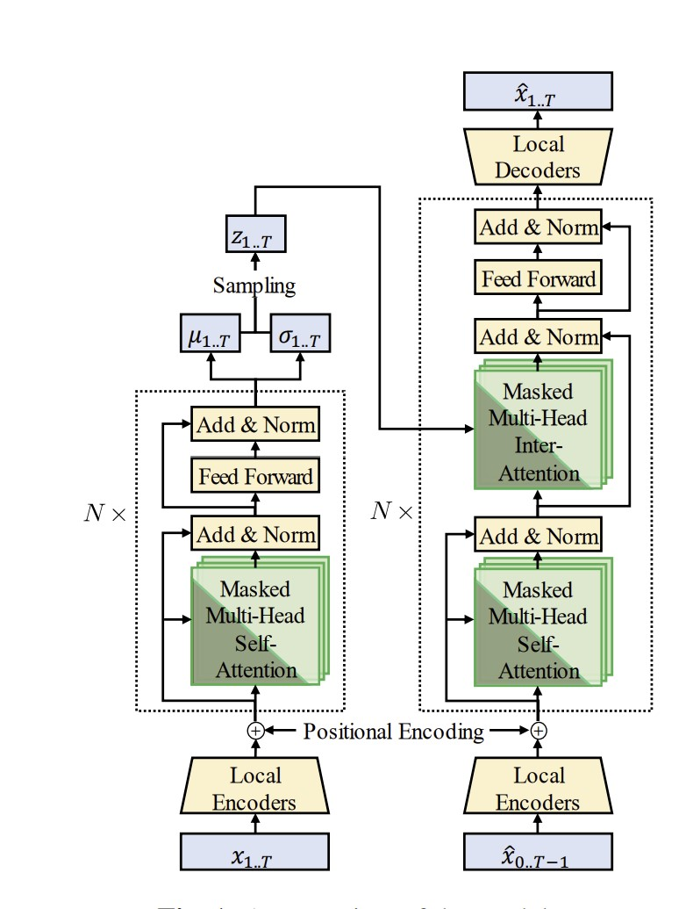

# Retrograde Chronicle of Generative Music Intelligence Evolution

##### A Compendium of Influential Works

> [!NOTE]
> _Last updated: 17th November 2024_

---

## Table of Contents

  - [About](#about)
  - [License](#license)
  - [Resources](#resources)
    - [General Timeline](#general-timeline)
      - [Key Milestones and Periods (Table)](#key-milestones-and-periods-table)
    - [Audio Generation](#audio-generation)
      - [2024](#2024-1)
      - [2023](#2023-1)
      - [2022](#2022-1)
      - [2021](#2021-1)
      - [2020](#2020-1)
      - [2017](#2017-1)
    - [Deep Learning Models for Symbolic Music Generation](#deep-learning-models-for-symbolic-music-generation)
        - [Task-Oriented Taxonomy](#task-oriented-taxonomy)
          - [Generation from Scratch](#generation-from-scratch)
            - [Methods](#methods)
          - [Conditional Generation](#conditional-generation)
            - [Methods](#methods-1)
          - [Controllable Generation](#controllable-generation)
            - [Methods](#methods-2)
          - [Performance Generation](#performance-generation)
            - [Methods](#methods-3)
          - [Interactive Generation](#interactive-generation)
            - [Methods](#methods-4)
        - [2024](#2024)
        - [2023](#2023)
        - [2022](#2022)
        - [2021](#2021)
        - [2020](#2020)
        - [2019](#2019)
        - [2018](#2018)
        - [2017](#2017)
        - [2016](#2016)
        - [2002](#2002)
        - [1990s](#1990s)
        - [Datasets](#datasets-1)
        - [Metrics](#metrics)
    - [Algorithmic Composition](#algorithmic-composition)
       - [2018](#2018)
       - [2015](#2015)
       - [2009](#2009)
       - [2000](#2000)
       - [1992](#1992)
       - [1989](#1989)
       - [1959](#1959)
    - [Tokenizers](#tokenizers)
      - [2024](#2024-2)
    - [Textual Contexts & Language Model Integration](#textual-contexts--language-models-integration)
      - [2024](#2024-3)
    - [Evaluation Methodologies](#evaluation-methodologies)
      - [2023](#2023-2)
    - [Reviews and Surveys](#reviews-and-surveys)
      - [2024](#2024-4)
      - [2023](#2023-3)
      - [2021](#2021-2)
    - [Model Architectures](#model-architectures)
      - [Comparison of Various Generative Models for Music Generation (Table)](#comparison-of-various-generative-models-for-music-generation-table)
      - [Representative Music Generation Models: Key Features and Technical Details (Table)](#representative-music-generation-models-key-features-and-technical-details-table)
    - [Datasets](#datasets)
      - [Overview of Music Datasets and Their Applications in AI Research (Table)](#overview-of-music-datasets-and-their-applications-in-ai-research-table)
  - [Acknowledgements](#acknowledgements)
    - [Reviews and Surveys](#reviews-and-surveys)
      - [2024](#2024-5)
      - [2021](#2021-3)
  - [Contributing](#contributing)

## About

This repository is maintained by [Joseph Chay](https://github.com/josephchay) presenting collected comprehensive and
influential works of resources that are related to the field of music generation. 
The resources are organized in a reverse chronological order, starting from the most recent to the earliest.

## License

This repository is licensed under the [MIT License](./LICENSE).

## Resources

### General Timeline

#### Key Milestones and Periods (Table)

| Key Innovation Milestones                                        | Periods    |
|------------------------------------------------------------------|------------|
| Breakthroughs in Diffusion Models and Multi-modal Generation     | 2020s      |
| Rise of Deep Learning and Generative Adversarial Networks (GANs) | 2010s      |
| Early Applications of Deep Learning                              | 2000s      |
| Development and Application of Symbolic Music Generation         | 1990s      |
| Establishing Foundational Technologies                           | 1970-1980s |
| Early Exploration                                                | 1950-1960s |

---

### Audio Generation

#### 2024

1. SongCreator
    - 
      

      Lei, S., Zhou, Y., Tang, B., Lam, M. W. Y., ... (2024, October 30). 
      SongCreator: Lyrics-based Universal Song Generation. arXiv.org.
     
      [Paper](https://arxiv.org/abs/2409.06029) • [Samples](https://thuhcsi.github.io/SongCreator/) • [HuggingFace](https://huggingface.co/papers/2409.06029)

2. Presto!
    - 
      
    
      Novack, Z., Zhu, G., Casebeer, J., McAuley, J., Berg-Kirkpatrick, T., & Bryan, N. J. (2024, October 7). 
      Presto! Distilling Steps and Layers for Accelerating Music Generation. arXiv.org. 
      
      [Paper](https://arxiv.org/abs/2410.05167) • [Samples](https://presto-music.github.io/web/) • [Video](https://www.youtube.com/watch?v=NE_x-5I19CY)

3. SeedMusic
    - 
      
      
      
      
      
    
      Bai, Y., Chen, H., Chen, J., Chen, Z., Deng, Y., ... (2024, September 13). 
      Seed-Music: A Unified Framework for High Quality and Controlled Music Generation. arXiv.org. 

      [Paper](https://arxiv.org/abs/2409.09214) • [Samples](https://team.doubao.com/en/special/seed-music)

4. FluxMusic
   - 

     Fei, Z., Fan, M., Yu, C., & Huang, J. (2024, September 1). 
     FLUX that Plays Music. arXiv.org. 
     
     [Paper](https://arxiv.org/abs/2409.00587) • [GitHub](https://github.com/feizc/FluxMusic)

5. Long-Form Generation with Latent Diffusion
    - 
      
    
      Evans, Z., Parker, J. D., Carr, C., Zukowski, Z., Taylor, J., & Pons, J. (2024, April 16). 
      Long-form music generation with latent diffusion. arXiv.org.
      
      [Paper](https://arxiv.org/abs/2404.10301) • [GitHub](https://github.com/Stability-AI/stable-audio-tools/) •
      [Samples](https://stability-ai.github.io/stable-audio-2-demo/) • [Dataset](https://www.kaggle.com/datasets/yamaerenay/spotify-tracks-dataset-19222021)

6. Tango 2
    - 
      
   
      Majumder, N., Hung, C., Ghosal, D., Hsu, W., Mihalcea, R., & Poria, S. (2024, April 15). 
      Tango 2: Aligning Diffusion-based Text-to-Audio Generations through Direct Preference Optimization. arXiv.org. 
      
      [Paper](https://arxiv.org/abs/2404.09956)

7. Multi-Source Diffusion Models
   - 
     
     Mariani, G., Tallini, I., Postolache, E., Mancusi, M., Cosmo, L., & Rodolà, E. (2023). 
     Multi-Source Diffusion Models for Simultaneous Music Generation and Separation. arXiv preprint arXiv:2302.02257.
      
     [Paper](https://arxiv.org/abs/2302.02257) • [Samples](https://gladia-research-group.github.io/multi-source-diffusion-models/)

8. MusicHiFi
   - Zhu, G., Caceres, J., Duan, Z., & Bryan, N. J. (2024, March 15). 
     MusicHiFi: Fast High-Fidelity Stereo Vocoding. arXiv.org. 
     
     [Paper](https://arxiv.org/abs/2403.10493) • [Samples](https://musichifi.github.io/web/) •
     [Video](https://www.youtube.com/watch?v=iytPC_6OsiQ&feature=youtu.be)

#### 2023

1. Amphion
    - 
      
      Zhang, X., Xue, L., Gu, Y., Wang, Y., Li, J., He, H., ... (2023, December 15). 
      Amphion: An Open-Source Audio, Music and Speech Generation Toolkit. arXiv.org.
      
      [Paper](https://arxiv.org/search/?query=music+generation&searchtype=all&abstracts=show&order=-announced_date_first&size=50&start=400) •
      [GitHub](https://github.com/open-mmlab/Amphion)

2. UniAudio
    -  
      
      
      
      Yang, D., Tian, J., Tan, X., ... (2023, October 1). 
      UniAudio: An Audio Foundation Model Toward Universal Audio Generation. arXiv.org. 
      
      [Paper](https://arxiv.org/abs/2310.00704) • [GitHub](https://github.com/uniaudio666/UniAudio) • [Samples](https://uniaudio666.github.io/demo_UniAudio/)

3. Mustango
   - 
     
     Melechovsky, J., Guo, Z., Ghosal, D., Majumder, N., Herremans, D., & Poria, S. (2023, November 14). 
     Mustango: Toward Controllable Text-to-Music Generation. arXiv.org.
   
     [Paper](https://arxiv.org/abs/2311.08355) • 
     [GitHub](https://github.com/AMAAI-Lab/mustango) • 
     [Demo & Dataset](https://huggingface.co/spaces/declare-lab/mustango)

4. Music ControlNet
   - 
     
     Wu, S., Donahue, C., Watanabe, S., & Bryan, N. J. (2023, November 13).
     Music ControlNet: Multiple Time-varying Controls for Music Generation. arXiv.org. 
     
     [Paper](https://arxiv.org/abs/2311.07069) • [Sample](https://musiccontrolnet.github.io/web/) • 
     [Video](https://www.youtube.com/watch?v=QVr-S-DyccU)

5. JEN-1 Composer
    - 
      
      Yao, Y., Li, P., Chen, B., & Wang, A. (2023, October 29). JEN-1 Composer: 
      A Unified Framework for High-Fidelity Multi-Track Music Generation. arXiv.org. 
      
      [Paper](https://arxiv.org/abs/2310.19180)

6. Mousai
   - 
     
     
     
   
     Schneider, F., Jin, Z., & Schölkopf, B. (2023, October 23). Mo\^ usai: Text-to-Music Generation with Long-Context Latent Diffusion. 
     arXiv preprint arXiv:2301.11757.
      
     [Paper](https://arxiv.org/abs/2301.11757)

7. ERNIE-Music
   - 
     
     Zhu, P., Pang, C., Wang, S., Chai, Y., Sun, Y., Tian, H., & Wu, H. (2023, September 21). 
     ERNIE-Music: Text-to-Waveform Music Generation with Diffusion Models. arXiv preprint arXiv:2302.04456.
      
     [Paper](https://arxiv.org/abs/2302.04456)

8. AudioLDM
   - 

      Liu, H., Chen, Z., Yuan, Y., Mei, X., Liu, X., Mandic, D., ... & Plumbley, M. D. (2023, September 9). 
      AudioLDM: Text-to-Audio Generation with Latent Diffusion Models. arXiv preprint arXiv:2301.12503.
       
      [Paper](https://arxiv.org/abs/2301.12503) • [Samples](https://audioldm.github.io/) • 
      [GitHub](https://github.com/haoheliu/AudioLDM)

9. Music Understanding LLaMA

   - 
     
     
     Liu, S., Hussain, A. S., Sun, C., & Shan, Y. (2023, August 22). 
     Music Understanding LLaMA: Advancing Text-to-Music Generation with Question Answering and Captioning. arXiv.org.
     
     [Paper](https://arxiv.org/abs/2308.11276)

10. AudioLDM2
    Liu, H., Yuan, Y., Liu, X., Mei, X., Kong, Q., Tian, Q., Wang, Y., Wang, W., Wang, Y., & Plumbley, M. D. (2023, August 10).
    AudioLDM 2: Learning Holistic Audio Generation with Self-supervised Pretraining. arXiv.org.
   
    [Paper](https://arxiv.org/abs/2308.05734) • 
    [Samples](https://audioldm.github.io/audioldm2/) • [GitHub](https://github.com/haoheliu/audioldm2)

11. JEN-1
    - 
       
     
       Li, P., Chen, B., Yao, Y., Wang, Y., Wang, A., & Wang, A. (2023, August 9). 
       JEN-1: Text-Guided Universal Music Generation with Omnidirectional Diffusion Models. arXiv.org.
      
       [Paper](https://arxiv.org/abs/2308.04729) • [Samples](https://www.jenmusic.ai/research)

12. MusiCLDM
    - 
      
      
      Chen, K., Wu, Y., Liu, H., Nezhurina, M., Berg-Kirkpatrick, T., & Dubnov, S. (2023, August 3). 
      MusicLDM: Enhancing Novelty in Text-to-Music Generation Using Beat-Synchronous Mixup Strategies. arXiv.org. 
      
      [Paper](https://arxiv.org/abs/2308.01546)

13. High-Fidelity Multi-Band Diffusion
    - 
     
      Roman, R. S., Adi, Y., Deleforge, A., Serizel, R., Synnaeve, G., & Défossez, A. (2023, August 2). 
      From Discrete Tokens to High-Fidelity Audio Using Multi-Band Diffusion. arXiv.org. 
     
      [Paper](https://arxiv.org/abs/2308.02560)

14. NaturalSpeech 2
    - 
      
      
      
      Shen, K., Ju, Z., Tan, X., ... (2023, May 30). 
      NaturalSpeech 2: Latent Diffusion Models are Natural and Zero-Shot Speech and Singing Synthesizers. arXiv.org.
      
      [Paper](https://arxiv.org/abs/2304.09116) • [Samples](https://speechresearch.github.io/naturalspeech2/)

15. Make-An-Audio 2
    - 
       
    
      Huang, J., Ren, Y., Huang, R., Yang, D., Ye, Z., Zhang, C., Liu, J., Yin, X., Ma, Z., & Zhao, Z. (2023, May 29). 
      Make-An-Audio 2: Temporal-Enhanced Text-to-Audio Generation. arXiv.org. 
      
      [Paper](https://arxiv.org/abs/2305.18474) • [GitHub](https://github.com/bytedance/Make-An-Audio-2)

16. SoundStorm 
    - 
     
      Borsos, Z., Sharifi, M., Vincent, D., Kharitonov, E., Zeghidour, N., & Tagliasacchi, M. (2023, May 16). 
      SoundStorm: Efficient Parallel Audio Generation. arXiv.org. 
      
      [Paper](https://arxiv.org/abs/2305.09636https://arxiv.org/abs/2305.09636)

17. Bark 
    - Bark: Text-Prompted Generative Audio Model (2023, April 10)
      
      [GitHub](https://github.com/suno-ai/bark) • [Samples](https://huggingface.co/spaces/suno/bark)

18. VALL-E-X
    - 
     
      Zhang, Z., Zhou, L., Wang, C., Chen, S., Wu, Y., Liu, S., ... & Wei, F. (2023, March 7). 
      Speak Foreign Languages with Your Own Voice: Cross-Lingual Neural Codec Language Modeling. arXiv preprint arXiv:2303.03926.
      
      [Paper](https://arxiv.org/abs/2303.03926)

19. Noise2Music
    - 

      Huang, Q., Park, D. S., Wang, T., Denk, T. I., Ly, A., Chen, N., ... & Han, W. (2023, March 6). 
      Noise2Music: Text-conditioned Music Generation with Diffusion Models. arXiv preprint arXiv:2302.03917.
      
      [Paper](https://arxiv.org/abs/2302.03917) • [Samples](https://google-research.github.io/noise2music/)

20. SingSong
    - 

       Donahue, C., Caillon, A., Roberts, A., Manilow, E., Esling, P., Agostinelli, A., ... & Engel, J. (2023, January 30). 
       SingSong: Generating musical accompaniments from singing. arXiv preprint arXiv:2301.12662.
       
       [Paper](https://arxiv.org/abs/2301.12662) • [Samples](https://storage.googleapis.com/sing-song/index.html)

21. Make-An-Audio
    - 
     
      Huang, R., Huang, J., Yang, D., Ren, Y., Liu, L., Li, M., ... & Zhao, Z. (2023, January 30). 
      Make-An-Audio: Text-To-Audio Generation with Prompt-Enhanced Diffusion Models. arXiv preprint arXiv:2301.12661.
      
      [Paper](https://arxiv.org/abs/2301.12661) • [Samples](https://text-to-audio.github.io/)

22. MusicLM
    - 
     
      Agostinelli, A., Denk, T. I., Borsos, Z., Engel, J., Verzetti, M., Caillon, A., ... & Frank, C. (2023, January 26). 
      Musiclm: Generating music from text. arXiv preprint arXiv:2301.11325.
      
      [Paper](https://arxiv.org/abs/2301.11325) • [Samples](https://google-research.github.io/seanet/musiclm/examples/) 
      [Dataset](https://www.kaggle.com/datasets/googleai/musiccaps)

23. Msanii
    - 

      Maina, K. (2023, January 16). Msanii: High Fidelity Music Synthesis on a Shoestring Budget. arXiv preprint arXiv:2301.06468.
      
      [Paper](https://arxiv.org/abs/2301.06468)

#### 2022

1. Musika
   - 
     

     Pasini, M., & Schlüter, J. (2022). Musika! Fast Infinite Waveform Music Generation. arXiv preprint arXiv:2208.08706.
     
     [Paper](https://arxiv.org/abs/2208.08706)

2. AudioLM
    - 

      Borsos, Z., Marinier, R., Vincent, D., Kharitonov, E., Pietquin, O., Sharifi, M., ... & Zeghidour, N. (2022). 
      Audiolm: a language modeling approach to audio generation. arXiv preprint arXiv:2209.03143.
      
      [Paper](https://arxiv.org/abs/2209.03143) • [Samples](https://google-research.github.io/seanet/audiolm/examples/)

#### 2021

1. RAVE
    - 
      
      Caillon, A., & Esling, P. (2021, December 15). RAVE: A variational autoencoder for fast and high-quality neural audio synthesis. 
      arXiv preprint arXiv:2111.05011.
      
      [Paper](https://arxiv.org/abs/2111.05011) • [GitHub](https://github.com/acids-ircam/RAVE)

#### 2020

1. Jukebox - OpenAI
   - 

      [Web](https://openai.com/blog/jukebox/) • [Paper](https://arxiv.org/abs/2005.00341) • 
      [GitHub](https://github.com/openai/jukebox/)

#### 2017

1. MuseNet - OpenAI
   - [Web](https://openai.com/blog/musenet/)

---

[🡹 Back to Table of Contents 🡹](#table-of-contents)

---

### Deep Learning Models for Symbolic Music Generation

#### Task-Oriented Taxonomy

| Types                   | Categories                                                                                       | Also Covers                                                              |
|-------------------------|--------------------------------------------------------------------------------------------------|--------------------------------------------------------------------------|
| Generation from Scratch | Melody, Polyphony, Multitrack                                                                    | N/A                                                                      |
| Conditional Generation  | Melody Generation Given Chord, Melody Harmonization, Accompaniment Arrangement, Score Inpainting | N/A                                                                      | 
| Controllable Generation | Style, Structure, Sentiment                                                                      | Generation from Scratch, Conditional Generation                          |
| Performance Generation  | Rendering, Composing                                                                             | Generation from Scratch, Conditional Generation, Controllable Generation |
| Interactive Generation  | Call and Response, Accompaniment, Application                                                    | Conditional Generation, Controllable Generation                          | 

##### Generation from Scratch

###### Methods

| Task             | Method                                                                                                                                                          | Year | Music Representation | Model Architecture  | Description                                                                      | Length of generated music |
|------------------|-----------------------------------------------------------------------------------------------------------------------------------------------------------------|------|----------------------|---------------------|----------------------------------------------------------------------------------|---------------------------|
| Melody           | Melody RNN  [Web](https://magenta.tensorflow.org/2016/07/15/lookback-rnn-attention-rnn/)                                                                    | 2016 | Event                | RNN                 | Lookback RNN; Attention RNN                                                      | Variable-length           |
|                  | Anticipation-RNN [Paper](https://arxiv.org/abs/1709.06404)                                                                                                  | 2017 | Sequence             | RNN                 | User-defined positional constraints                                              | Variable-length           |
|                  | MusicVAE [Paper](https://arxiv.org/abs/1803.05428)                                                                                                          | 2018 | Piano roll           | RNN-based VAE       | Long-term music structure; Hierarchical decoder                                  | 16 bars                   |
|                  | [Paper](https://arxiv.org/abs/2202.06180)                                                                                                                       | 2021 | Sequence             | RNN-based EC²-VAE   | Long-term music representations; Hierarchical contextual constraints.            | 8 bars                    |
|                  | GLSR-VAE  [Paper](https://ieeexplore.ieee.org/document/8280895)                                                                                             | 2017 | Sequence             | RNN-based VAE       | Continuous attributes; Geodesic latent space regularization                      | 2 bars                    |
|                  | [Paper](https://arxiv.org/abs/2004.05485)                                                                                                                       | 2021 | Sequence             | β-VAE and AR-VAE    | Continuous-valued attributes; Latent space disentanglement and regularization    | 1 bar                     |
|                  | SeqGAN  [Paper](https://www.researchgate.net/publication/308324937_SeqGAN_Sequence_Generative_Adversarial_Nets_with_Policy_Gradient)                        | 2017 | Sequence             | RNN-CNN-based GAN   | Reinforcement learning; Monte Carlo search                                       | 12.8s                     |
|                  | RL Tuner  [Paper](https://openreview.net/forum?id=Syyv2e-Kx)                                                                                                | 2017 | Piano roll           | RNN                 | Reinforcement learning; DQN algorithm                                            | 32 notes (16th)           |
| Polyphony        | DeepBach  [Paper](https://proceedings.mlr.press/v70/hadjeres17a.html)                                                                                       | 2016 | Sequence             | RNN                 | User-defined constraints                                                         | Variable-length           |
|                  | [Paper](https://www.cs.hmc.edu/~ddjohnson/tied-parallel/johnson2017tiedparallel.pdf)                                                                            | 2017 | Piano roll           | RNN                 | Transposition-invariance; Tied parallel LSTM-NADE; Bi-axial LSTM                 | Variable-length           |
|                  | [Paper](https://arxiv.org/abs/1810.03226)                                                                                                                       | 2018 | Piano roll           | CNN & RNN-based VAE | Bar-level CNN feature learning                                                   | 8, 16 or 32 bars          |
|                  | [Paper](https://proceedings.mlr.press/v97/ziegler19a.html)                                                                                                      | 2019 | Piano roll           | RNN-based VAE       | Latent normalizing flows; Non-autoregressive generation                          | Variable-length           |
|                  | PianoTree VAE  [Paper](https://arxiv.org/abs/2008.07118)                                                                                                    | 2020 | Event                | RNN-based VAE       | Tree structured musical syntax                                                   | 8 beats                   |
|                  | [Paper](https://www.researchgate.net/publication/348980503_Deep_Music_Information_Dynamics)                                                                     | 2022 | Piano roll           | VAE                 | Using only linear layers; bit-rate reduction                                     | 1 bar                     |
|                  | C-RNN-GAN  [Paper](https://arxiv.org/abs/1611.09904)                                                                                                        | 2016 | Event                | RNN-based GAN       | Continuous sequential data                                                       | Variable-length           |
|                  | Music Transformer  [Paper](https://arxiv.org/abs/1809.04281)                                                                                                | 2019 | Event                | Transformer         | Relative attention mechanism; Compelling long-term structure                     | Minute-long               |
|                  | MuseNet  [Web](http://openai.com/blog/musenet)                                                                                                              | 2019 | Event                | Transformer         | Same general-purpose unsupervised technology as GPT-2                            | 4-minute long             |
|                  | [Paper](https://ieeexplore.ieee.org/document/9132664)                                                                                                           | 2020 | Event                | Transformer         | Adversarial learning; Novel computation of reward for each generated step (REGS) | Up to 1024 tokens         |
| Multitrack Music | MuseGAN  [Paper](https://arxiv.org/abs/1709.06298)                                                                                                          | 2018 | Piano roll           | CNN-based GAN       | WGAN-GP; Multi-track interdependency and temporal structure                      | 4 bars                    |
|                  | [Paper](https://arxiv.org/abs/1804.09399)                                                                                                                       | 2018 | Piano roll           | CNN-based GAN       | Binary neurons for binary-valued piano roll                                      | 4 bars                    |
|                  | DMB-GAN  [Paper](https://www.semanticscholar.org/paper/A-GAN-Model-With-Self-attention-Mechanism-To-Music-Guan-Yu/4613a5e9218bcb9b439c500bc78622183e802893) | 2019 | Piano roll           | GAN                 | Self-attention mechanism; Duel Multi-branches GAN architecture                   | 4 bars                    |
|                  | [Paper](https://arxiv.org/abs/1806.00195)                                                                                                                       | 2018 | Event                | RNN-based VAE       | An extension of MusicVAE; Latent space manipulations                             | 1 bar                     |
|                  | MNGANs  [Paper](https://dl.acm.org/doi/10.1145/3240508.3240604)                                                                                             | 2018 | Piano roll           | CNN-based GAN       | Optimizing musicality and novelty alternately                                    | 4 bars                    |
|                  | LakhNES  [Paper](https://arxiv.org/abs/1907.04868)                                                                                                          | 2019 | Event                | Transformer-XL      | Cross-domain pre-training                                                        | Variable-length           |
|                  | MMM  [Paper](https://arxiv.org/abs/2008.06048)                                                                                                              | 2020 | Event                | Transformer         | Concatenating time-ordered sequence of each track into a single sequence         | 4 or 8 bars               |
|                  | MMT  [Paper](https://arxiv.org/abs/2207.06983)                                                                                                              | 2023 | Event                | Transformer         | New multitrack representation; New measure for musical self-attention            | Up to 1,024 codes         |

##### Conditional Generation

###### Methods

| Task                          | Method                                                                                                                                           | Year | Music Representation | Model Architecture | Description                                                                                                                     | Length of generated music |
|-------------------------------|--------------------------------------------------------------------------------------------------------------------------------------------------|------|----------------------|--------------------|---------------------------------------------------------------------------------------------------------------------------------|---------------------------|
| Melody Generation Given Chord | MidiNet  [Paper](https://arxiv.org/abs/1703.10847)                                                                                           | 2017 | Piano roll           | CNN-base GAN       | Generating music one bar after another; Conditioner CNN                                                                         | 8 bars                    |
|                               | CRMCG  [Paper](https://dl.acm.org/doi/10.1145/3219819.3220105)                                                                               | 2018 | Sequence             | RNN                | Encoder-decoder framework                                                                                                       | Variable-length           |
|                               | JazzGAN  [Paper](https://musicalmetacreation.org/mume2018/proceedings/Trieu.pdf)                                                             | 2018 | Piano roll or Event  | RNN-based GAN      | Improvising jazz melodies over chord progressions; Harmonic bricks for phrase segmentation                                      | Variable-length           |
|                               | BebopNet  [Paper](https://program.ismir2020.net/static/final_papers/132.pdf)                                                                 | 2020 | Sequence             | RNN                | Monophonic harmony-constrained jazz improvisations; Personalized generation                                                     | Variable-length           |
|                               | MINGUS  [Paper](https://archives.ismir.net/ismir2021/paper/000051.pdf)                                                                       | 2021 | Sequence             | Transformer        | Two parallel transformers for pitch and duration, respectively                                                                  | Up to 35 tokens           |
| Melody Harmonization          | [Paper](https://arxiv.org/abs/1712.01011)                                                                                                        | 2017 | Sequence             | RNN                | BiLSTM; A chord per bar                                                                                                         | Up to 16 bars             |
|                               | MTHarmonizer  [Paper](https://arxiv.org/abs/2001.02360)                                                                                      | 2021 | Sequence             | RNN                | Chord functions; A chord every half bar                                                                                         | 4-32 bars                 |
|                               | [Paper](https://www.researchgate.net/publication/352170954_Melody_Harmonization_Using_Orderless_Nade_Chord_Balancing_and_Blocked_Gibbs_Sampling) | 2021 | Sequence             | RNN                | Orderless NADE; Chord balancing; Blocked Gibbs sampling                                                                         | Variable-length           |
|                               | SurpriseNet  [Paper](https://arxiv.org/abs/2108.00378)                                                                                       | 2021 | Sequence             | RNN-based VAE      | Conditional VAE; Surprise contour                                                                                               | Variable-length           |
|                               | AutoHarmonizer  [Paper](https://arxiv.org/abs/2112.11122)                                                                                    | 2021 | Sequence             | RNN                | Controllable harmonic rhythm                                                                                                    | Variable-length           |
| Accompaniment Arrangement     | [Paper](https://arxiv.org/abs/1807.11161)                                                                                                        | 2018 | Piano roll           | GAN                | Recurrent CNN model; three new symbolic-domain harmonic features                                                                | 8 bars                    |
|                               | MICA  [Paper](https://dl.acm.org/doi/10.1145/3219819.3220105)                                                                                | 2018 | Sequence             | RNN                | Attention cell and MLP cell                                                                                                     | Variable-length           |
|                               | PopMAG  [Paper](https://arxiv.org/abs/2008.07703)                                                                                            | 2020 | Event                | Transformer        | MuMIDI representation; Extra-long context                                                                                       | Up to 32 bars             |
| Music Inpainting              | Coconet  [Paper](https://arxiv.org/abs/1903.07227)                                                                                           | 2017 | Piano roll           | CNN                | Orderless NADE; Blocked Gibbs Sampling                                                                                          | 128 notes (16th)          |
|                               | [Paper](https://nips2018creativity.github.io/doc/infilling_piano_performances.pdf)                                                               | 2018 | Event                | Transformer        | Virtuosic piano performances; NoteTuple representation [[Paper](https://nips2018creativity.github.io/doc/Transformer_NADE.pdf)] | 16 or 32 notes            |
|                               | ES-Net  [Paper](https://arxiv.org/abs/2008.08927)                                                                                            | 2020 | Piano roll           | U-Net              | Edit events; Note by note control                                                                                               | 8 bars                    |
|                               | InpaintNet  [Paper](https://arxiv.org/abs/1907.01164)                                                                                        | 2019 | Sequence             | RNN-based VAE      | Traversing latent space                                                                                                         | 2-6 bars                  |
|                               | Music SketchNet  [Paper](https://arxiv.org/abs/2008.01291)                                                                                   | 2020 | Sequence             | RNN-based VAE      | SketchVAE, SketchInpainter and SketchConnector; User-specified pitch and rhythm snippets                                        | 4 bars                    |
|                               | CLSM  [Paper](https://arxiv.org/abs/2111.11703)                                                                                              | 2021 | Sequence             | Transformer & LSTM | Contextual latent space model; Positional constraints; Interpolations or variations                                             | Up to 4 bars              |
|                               | [Paper](https://arxiv.org/abs/2108.05064)                                                                                                        | 2021 | Event                | XLNet              | A novel relative bar coding; Look-ahead onset prediction                                                                        | Up to 128 notes           |
|                               | [Paper](https://arxiv.org/abs/2202.05528)                                                                                                        | 2022 | Event                | Transformer        | Masked pretraining and finetuning; Track level and bar level controls                                                           | Up to 16 bars             |

##### Controllable Generation

###### Methods

| Controlled Aspect | Method                                                                                                                                         | Year | Music Representation | Model Architecture      | Description                                                                                                                                                                                                                                                           | Length of generated music |
|-------------------|------------------------------------------------------------------------------------------------------------------------------------------------|------|----------------------|-------------------------|-----------------------------------------------------------------------------------------------------------------------------------------------------------------------------------------------------------------------------------------------------------------------|---------------------------|
| Style             | DeepJ  [Paper](https://arxiv.org/abs/1801.00887)                                                                                           | 2018 | Piano roll           | RNN                     | A specific mixture of composer styles                                                                                                                                                                                                                                 | Variable-length           |
|                   | BandNet  [Paper](https://arxiv.org/abs/1812.07126)                                                                                         | 2019 | Event                | RNN                     | The style of Beatles; Templated-base method to generate structured music                                                                                                                                                                                              | 4-16 bars                 |
|                   | MSMICA  [Paper](https://dl.acm.org/doi/10.1145/3374915)                                                                                    | 2020 | Sequence             | RNN                     | Extension of MICA [[Paper](https://dl.acm.org/doi/10.1145/3219819.3220105)] with style control; Reinforcement learning similar to SeqGAN [Paper](https://www.researchgate.net/publication/308324937_SeqGAN_Sequence_Generative_Adversarial_Nets_with_Policy_Gradient) | Variable-length           |
|                   | [Paper](https://arxiv.org/abs/1912.05537)                                                                                                      | 2020 | Event                | Transformer             | Obtaining a global style representation of style from a given performance                                                                                                                                                                                             | Up to 2048 tokens         |
|                   | MIDI-VAE  [Paper](https://arxiv.org/abs/1809.07600)                                                                                        | 2018 | Piano roll           | RNN-based VAE           | Unaligned style transfer; parallel VAE with a shared latent space and a style classifier                                                                                                                                                                              | 1 bar                     |
|                   | [Paper](https://www.semanticscholar.org/paper/Transferring-the-Style-of-Homophonic-Music-Using-Lu-Su/24f2f6adc36003eee89a7e156277a5458b61177e) | 2018 | Piano roll           | LSTM & CNN              | Style transfer of accompaniment in homophonic music                                                                                                                                                                                                                   | Variable-length           |
|                   | MuseMorphose  [Paper](https://arxiv.org/abs/2105.04090)                                                                                    | 2021 | Event                | Transformer VAE         | Style transfer of long musical pieces; User specified bar-level musical attributes                                                                                                                                                                                    | Up to 32 bars             |
|                   | [Paper](https://arxiv.org/abs/1809.07575)                                                                                                      | 2018 | Event                | GAN                     | Style transfer with cycle consistency loss                                                                                                                                                                                                                            | 4 bars                    |
|                   | ChordGAN  [Paper](https://aimc2021.iem.at/wp-content/uploads/2021/06/AIMC_2021_Lu_Dubnov.pdf)                                              | 2021 | Piano roll           | CNN-based GAN           | Stylistic rendering of chords into notes; Chroma feature extraction;                                                                                                                                                                                                  | 16 bars                   |
| Structure         | StructureNet  [Paper](https://ismir2018.ircam.fr/doc/pdfs/126_Paper.pdf)                                                                   | 2018 | Sequence             | RNN                     | Structure-tagging algorithm for creating structure dataset; Duration repeat and duration-interval repeat                                                                                                                                                              | 16 bars                   |
|                   | SSMGAN  [Paper](https://www.cs.cmu.edu/~jharsh/papers/music_workshop_paper.pdf)                                                            | 2019 | Event                | RNN-CNN-based VAE GAN   | Representing self-repetition with self-similarity; Low dimensional measure embeddings                                                                                                                                                                                 | Variable-length           |
|                   | MusicFrameworks  [Paper](https://archives.ismir.net/ismir2021/paper/000017.pdf)                                                            | 2021 | Event                | Transformer & RNN & CNN | Multi-level repetition and structure; Multi-step generative process                                                                                                                                                                                                   | Full-song-length          |
|                   | HAT  [Paper](https://arxiv.org/abs/2109.06441)                                                                                             | 2021 | Event                | Transformer             | Harmony (texture and form)-aware learning; Hierarchical structure-enhanced module                                                                                                                                                                                     | Full-song-length          |
|                   | PopMNet  [Paper](https://www.sciencedirect.com/science/article/pii/S000437022030062X)                                                      | 2020 | Sequence             | RNN & CNN               | Bar-level pairwise relations; Representing structure using Directed acyclic graph; Two stage manner                                                                                                                                                                   | Variable-length           |
|                   | MELONS  [Paper](https://arxiv.org/abs/2110.05020)                                                                                          | 2022 | Event                | Transformer             | Graph representation of music structure; Eight types of bar-level relations; Multi-step generation                                                                                                                                                                    | Full-song-length          |
|                   | Museformer  [Paper](https://arxiv.org/abs/2210.10349)                                                                                      | 2022 | Event                | Transformer             | Music repetition structures via bar-level similarity statistic; Fine- and coarse-grained attention                                                                                                                                                                    | Full-song-length          |
| Sentiment         | [Paper](https://arxiv.org/abs/2103.06125)                                                                                                      | 2019 | Event                | LSTM                    | VGMIDI dataset with valence-arousal (VA) annotation; Sentiment unit within mLSTM                                                                                                                                                                                      | Variable-length           |
|                   | [Paper](https://www.researchgate.net/publication/345425604_An_Emotional_Symbolic_Music_Generation_System_based_on_LSTM_Networks)               | 2019 | Piano roll           | LSTM                    | Global condition of emotional vectors; Four quadrants of VA emotional space as four emotions                                                                                                                                                                          | 8 bars                    |
|                   | Bardo Composer  [Paper](https://webdocs.cs.ualberta.ca/~santanad/papers/2020/ferreiraLW20.pdf)                                             | 2020 | Event                | Transformer             | Language model with Stochastic Bi-Objective Beam Search; GPT-2 emotion classifier                                                                                                                                                                                     | Variable-length           |
|                   | [Paper](https://dorienherremans.com/sites/default/files/2104.13056.pdf)                                                                        | 2021 | Event                | RNN & Transformer       | Calculating valence of chord progression; Seq2seq; Translating conditions into musical events                                                                                                                                                                         | 4-32 bars                 |
|                   | Music FaderNets  [Paper](https://arxiv.org/abs/2007.15474)                                                                                 | 2020 | Event                | GM-VAE                  | Arousal transfer; Inferring high-level features from latent low-level representations                                                                                                                                                                                 | Up to 100 tokens          |

##### Performance Generation

###### Methods

| Method                                                                                                                                                                                     | Year | Category |         | Music Representation | Model Architecture          | Description                                                                        | Length of generated music |
|--------------------------------------------------------------------------------------------------------------------------------------------------------------------------------------------|------|----------|---------|----------------------|-----------------------------|------------------------------------------------------------------------------------|---------------------------|
|                                                                                                                                                                                            |      | Render   | Compose |                      |                             |                                                                                    |                           |
| [Paper](https://archives.ismir.net/ismir2019/paper/000105.pdf)                                                                                                                             | 2019 | ✓        |         | Event                | Conditional Variational RNN | Generating performance data conditioned on music score and interpretation sequence | Variable-length           |
| VirtuosoNet  [Paper](https://archives.ismir.net/ismir2019/paper/000112.pdf)                                                                                                            | 2019 | ✓        |         | Sequence             | RNN & VAE                   | Hierarchical Attention network (HAN); A multi-scale approach                       | Variable-length           |
| [Paper](https://proceedings.mlr.press/v97/jeong19a/jeong19a.pdf)                                                                                                                           | 2019 | ✓        |         | Graph                | GNN & HAN                   | Representing six edge types in musical score using graph; A multi-scale approach   | Variable-length           |
| Performance RNN  [Web](https://magenta.tensorflow.org/performance-rnn)                                                                                                                 | 2017 |          | ✓       | Event                | RNN                         | Generating polyphonic music with expressive timing and dynamics                    | 30s                       |
| [Paper](https://arxiv.org/abs/1808.03715)                                                                                                                                                  | 2018 |          | ✓       | Event                | RNN                         | Jointly predicting notes and their expressive and dynamics                         | 30s                       |
| Pop Music Transformer  [Paper](https://arxiv.org/abs/2002.00212)                                                                                                                       | 2020 |          | ✓       | Event                | Transformer-XL              | REMI for modeling beat-bar-phrase hierarchical structure in music                  | Variable-length           |
| Compound Word Transformer  [Paper](https://www.researchgate.net/publication/363385989_Compound_Word_Transformer_Learning_to_Compose_Full-Song_Music_over_Dynamic_Directed_Hypergraphs) | 2021 |          | ✓       | Event                | Transformer                 | Compound words; Different feed-forward heads for tokens of different types         | Full-song-length          |
| [Paper](https://www.semanticscholar.org/paper/Symbolic-Music-Generation-with-Transformer-GANs-Muhamed-Li/f07c5c540233b22f0ca154c80c713e2aed3c9606)                                         | 2021 |          | ✓       | Event                | Transformer-GAN             | Gumbel-Softmax; WGAN, RSGAN, PPO-GAN                                               | 128 tokens                |
| GrooVAE  [Paper](https://arxiv.org/abs/1905.06118)                                                                                                                                     | 2019 |          | ✓       | Sequence             | RNN-VIB                     | Seq2seq; Humanization, Drum Infilling and Tap2drum                                 | Up to 16 bars             |

##### Interactive Generation

###### Methods

| Method                                                                                                                                              | Year | Category          |               | Music Representation | Model Architecture       | Description                                                                                                                                          | Length of generated music |
|-----------------------------------------------------------------------------------------------------------------------------------------------------|------|-------------------|---------------|----------------------|--------------------------|------------------------------------------------------------------------------------------------------------------------------------------------------|---------------------------|
|                                                                                                                                                     |      | Call and response | Accompaniment |                      |                          |                                                                                                                                                      |                           |
| [Paper](https://www.researchgate.net/publication/361526574_Deep_Music_Towards_Musical_Dialogue)                                                     | 2017 | ✓                 |               | Piano roll           | Agnostic                 | Learning semantic embeddings of musical input; Combination of generation and unit selection                                                          | Variable-length           |
| [Paper](https://arxiv.org/abs/1904.13285)                                                                                                           | 2019 | ✓                 |               | Event                | RNN                      | A hybrid of improvisation with pitches generated by models and rhythms provided by human                                                             | Variable-length           |
| The Bach Doodle [Paper](https://arxiv.org/abs/1907.06637)                                                                                           | 2019 |                   | ✓             | Piano roll           | CNN                      | Using Coconet [[Paper](https://arxiv.org/abs/1903.07227)] for melody harmonization (4-voice) in the style of Bach                                    | 2 bars                    |
| RL-duet [Paper](https://www.researchgate.net/publication/341892097_RL-Duet_Online_Music_Accompaniment_Generation_Using_Deep_Reinforcement_Learning) | 2020 |                   | ✓             | Sequence             | Attention-guided RNN-CNN | Reinforcement learning; Learning rewards from training data considering both the inter-part and intra-part harmonization of human and machine inputs | Variable-length           |

#### 2024

1. JEN-1 DreamStyler
    - 
      
      

      Chen, B., Li, P., Yao, Y., & Wang, A. (2024, June 18). 
      JEN-1 DreamStyler: Customized Musical Concept Learning via Pivotal Parameters Tuning. arXiv.org. 
      
      [Paper](https://arxiv.org/abs/2406.12292) • [Samples](https://www.jenmusic.ai/research#DreamStyler)

2. Cascaded Diffusion Models
    - Wang, Z., Min, L., & Xia, G. (2024, May 16). 
      Whole-Song Hierarchical Generation of Symbolic Music Using Cascaded Diffusion Models. arXiv.org. 
    
      [Paper](https://arxiv.org/abs/2405.09901) • [GitHub and Model](https://github.com/ZZWaang/whole-song-gen) •
      [Samples](https://wholesonggen.github.io/)

3. COMPOSERX
   - 
     
      Deng, Q., Yang, Q., Yuan, R., Huang, Y., Wang, Y., Liu, X., Tian, Z., Pan, J., ... (2024, April 28). 
      ComposerX: Multi-Agent Symbolic Music Composition with LLMs. arXiv.org. 
    
      [Paper](https://arxiv.org/abs/2404.18081)

4. Non-Differentiable Rule Guided Diffusion
   - 
     
     Huang, Y., Ghatare, A., Liu, Y., Hu, Z., Zhang, Q., Sastry, C. S., Gururani, S., Oore, S., & Yue, Y. (2024, February 22). 
     Symbolic Music Generation with Non-Differentiable Rule Guided Diffusion. arXiv.org. 
     
     [Paper](https://arxiv.org/abs/2402.14285)

5. Surveys
   - Le, D., Bigo, L., Keller, M., & Herremans, D. (2024, February 27). 
     Natural Language Processing Methods for Symbolic Music Generation and Information Retrieval: a Survey. arXiv.org. 
   
     [Paper](https://arxiv.org/abs/2402.17467)

#### 2023

1. RL-Chord
   - Ji, S., Yang, X., Luo, J., & Li, J. (2023). RL-Chord: CLSTM-Based Melody Harmonization Using Deep Reinforcement Learning. 
     IEEE Transactions on Neural Networks and Learning Systems. 
   
     [Paper](https://ieeexplore.ieee.org/abstract/document/10063204)

2. FIGRARO
   - 
     
     von Rütte, D., Biggio, L., Kilcher, Y., & Hoffman, T. (2022). FIGARO: Generating Symbolic Music with Fine-Grained Artistic Control. 
     Accepted ICLR 2023. 
     
     [Paper](https://arxiv.org/pdf/2201.10936v3)

#### 2022

1. Museformer
   - Yu, B., Lu, P., Wang, R., Hu, W., Tan, X., Ye, W., ... & Liu, T. Y. (2022). 
     Museformer: Transformer with Fine-and Coarse-Grained Attention for Music Generation. NIPS 2022.
     
     [Paper](https://openreview.net/forum?id=GFiqdZOm-Ei) • [NIPS Presentation](https://nips.cc/virtual/2022/poster/54604)

2. Bar Transformer 
   - Qin, Y., Xie, H., Ding, S., Tan, B., Li, Y., Zhao, B., & Ye, M. (2022). 
     Bar transformer: a hierarchical model for learning long-term structure and generating impressive pop music. Applied Intelligence, 1-19.
   
     [Paper](https://link.springer.com/article/10.1007/s10489-022-04049-3)

3. Symphony Generation with Permutation Invariant Language Model
   - 
     
      Liu, J., Dong, Y., Cheng, Z., Zhang, X., Li, X., Yu, F., & Sun, M. (2022). 
      Symphony Generation with Permutation Invariant Language Model. 
      
      [Paper](https://arxiv.org/pdf/2205.05448) • [Code](https://github.com/symphonynet/SymphonyNet) •
      [Samples](https://symphonynet.github.io/)

4. Theme Transformer
   - 
     
     Shih, Y. J., Wu, S. L., Zalkow, F., Muller, M., & Yang, Y. H. (2022). 
     Theme Transformer: Symbolic Music Generation with Theme-Conditioned Transformer. 
     IEEE Transactions on Multimedia. 
     
     [Paper](https://arxiv.org/abs/2111.04093) • [GitHub](https://github.com/atosystem/ThemeTransformer)

#### 2021

1. Compound Word Transformer 
   - Hsiao, W. Y., Liu, J. Y., Yeh, Y. C., & Yang, Y. H. (2021, May). Compound word transformer: 
     Learning to compose full-song music over dynamic directed hypergraphs. 
     In Proceedings of the AAAI Conference on Artificial Intelligence (Vol. 35, No. 1, pp. 178-186).
   
     [Paper](https://ojs.aaai.org/index.php/AAAI/article/view/16091) •
     [GitHub](https://github.com/YatingMusic/compound-word-transformer)

2. Melody Generation from Lyrics
    - 
     
       Yu, Y., Srivastava, A., & Canales, S. (2021). Conditional lstm-gan for melody generation from lyrics. 
       ACM Transactions on Multimedia Computing, Communications, and Applications (TOMM), 17(1), 1-20.
     
      [Paper](https://dl.acm.org/doi/abs/10.1145/3424116)

3. Music Generation with Diffusion Models
   - 
     
     Mittal, G., Engel, J., Hawthorne, C., & Simon, I. (2021). 
     Symbolic music generation with diffusion models. arXiv preprint arXiv:2103.16091.
     
     [Paper](https://arxiv.org/abs/2103.16091) • [GitHub](https://github.com/magenta/symbolic-music-diffusion)

4. Reviews
   - Hernandez-Olivan, C., & Beltran, J. R. (2021). Music composition with deep learning: A review. 
     arXiv preprint arXiv:2108.12290.
   
     [Paper](https://arxiv.org/abs/2108.12290)

#### 2020

1. Pop Music Transformer
   - Huang, Y. S., & Yang, Y. H. (2020, October). Pop music transformer:
   Beat-based modeling and generation of expressive pop piano compositions. 
   In Proceedings of the 28th ACM International Conference on Multimedia (pp. 1180-1188).
   
   [Paper](https://dl.acm.org/doi/abs/10.1145/3394171.3413671) • [GitHub](https://github.com/YatingMusic/remi)

2. Controllable Polyphonic Music Generation
   - 
     
     Wang, Z., Wang, D., Zhang, Y., & Xia, G. (2020). Learning interpretable representation for controllable polyphonic music generation. 
     arXiv preprint arXiv:2008.07122.
     
     [Paper](https://arxiv.org/abs/2008.07122) • [Web](https://program.ismir2020.net/poster_5-05.html) • [Video](https://www.youtube.com/watch?v=Sb6jXP_7dtE&t=28s&ab_channel=ISMIR2020)

3. Multitrack Music Generation
   - 

      Ens, J., & Pasquier, P. (2020). Mmm: Exploring conditional multi-track music generation with the transformer. 
      arXiv preprint arXiv:2008.06048.
      
      [Paper](https://arxiv.org/abs/2008.06048) • [Web](https://jeffreyjohnens.github.io/MMM/) • [Colab](https://colab.research.google.com/drive/1xGZW3GP24HUsxnbebqfy1iCyYySQ64Vs?usp=sharing) [Github (AI Guru)](https://github.com/AI-Guru/MMM-JSB)

4. Transformer-XL
   - 
     
     Wu, X., Wang, C., & Lei, Q. (2020). Transformer-XL Based Music Generation with Multiple Sequences of Time-valued Notes. 
     arXiv preprint arXiv:2007.07244.
     
     [Paper](https://arxiv.org/abs/2007.07244)

5. Transformer VAE
   - 
     
     Jiang, J., Xia, G. G., Carlton, D. B., Anderson, C. N., & Miyakawa, R. H. (2020, May). 
     Transformer vae: A hierarchical model for structure-aware and interpretable music representation learning. 
     In ICASSP 2020-2020 IEEE International Conference on Acoustics, Speech and Signal Processing (ICASSP) (pp. 516-520). IEEE.
     
     [Paper](https://ieeexplore.ieee.org/document/9054554)

6. Deep Learning Techniques for Music Generation 
   - Briot, J. P., Hadjeres, G., & Pachet, F. (2020). Deep learning techniques for music generation (pp. 1-249). Springer.
   
     [Book Digital Copy](https://www.researchgate.net/profile/Jean-Pierre-Briot/publication/333014972_Deep_Learning_Techniques_for_Music_Generation_-_A_Survey/links/61771cb6a767a03c14b4d6f0/Deep-Learning-Techniques-for-Music-Generation-A-Survey.pdf)

7. Reviews
   - Ji, S., Luo, J., & Yang, X. (2020). A Comprehensive Survey on Deep Music Generation: Multi-level Representations, Algorithms, Evaluations, and Future Directions. arXiv preprint arXiv:2011.06801.
   
     [Paper](https://arxiv.org/abs/2011.06801)

#### 2019

1. TonicNet
   - 
     
      Peracha, O. (2019). Improving polyphonic music models with feature-rich encoding. arXiv preprint arXiv:1911.11775.
      
      [Paper](https://arxiv.org/abs/1911.11775)

2. LakhNES
   - 

      Donahue, C., Mao, H. H., Li, Y. E., Cottrell, G. W., & McAuley, J. (2019). 
      LakhNES: Improving multi-instrumental music generation with cross-domain pre-training. arXiv preprint arXiv:1907.04868.
      
      [Paper](https://arxiv.org/abs/1907.04868)

3. R-Transformer
   - 
     
      Wang, Z., Ma, Y., Liu, Z., & Tang, J. (2019). R-transformer: Recurrent neural network enhanced transformer. 
      arXiv preprint arXiv:1907.05572.
      
      [Paper](https://arxiv.org/abs/1907.05572)

4. Maia Music Generator
   - 
     
      Maia Music Generator. (2019). Maia: A New Music Generator. 
      
      [Web](https://maia.music.blog/2019/05/13/maia-a-new-music-generator/)

5. Coconet: Counterpoint by Convolution
   - 
     
      Huang, C. Z. A., Cooijmans, T., Roberts, A., Courville, A., & Eck, D. (2019). Counterpoint by convolution. 
      arXiv preprint arXiv:1903.07227.
      
      [Paper](https://arxiv.org/abs/1903.07227) • [Web](https://coconets.github.io/)

6. Reviews
   - Briot, J. P., Hadjeres, G., & Pachet, F. D. (2017). Deep learning techniques for music generation--a survey. arXiv preprint arXiv:1709.01620.
   
     [Paper](https://arxiv.org/abs/1709.01620)

#### 2018

1. Music Transformer - Google Magenta
   - 
   - 
     
      Huang, C. Z. A., Vaswani, A., Uszkoreit, J., Shazeer, N., Simon, I., Hawthorne, et al. (2018). 
      Music transformer. arXiv preprint arXiv:1809.04281.
      
      [Web](https://magenta.tensorflow.org/music-transformer) • [Paper](https://arxiv.org/pdf/1809.04281.pdf)

2. Imposing Higher-Level Structure in Polyphonic Music
   - 
     
      Lattner, S., Grachten, M., & Widmer, G. (2018). Imposing higher-level structure in polyphonic music generation using convolutional restricted boltzmann machines and constraints. 
      Journal of Creative Music Systems, 2, 1-31.
      
      [Paper](https://arxiv.org/pdf/1612.04742.pdf)

3. MusicVAE - Google Magenta
   - 
     
      Roberts, A., Engel, J., Raffel, C., Hawthorne, C., & Eck, D. (2018, July). 
      A hierarchical latent vector model for learning long-term structure in music. 
      In International Conference on Machine Learning (pp. 4364-4373). PMLR.
      
      [Code](https://github.com/tensorflow/magenta/tree/master/magenta/models/music_vae) • 
      [Google Colab](https://colab.research.google.com/notebooks/magenta/music_vae/music_vae.ipynb) • 
      [Explanation](https://medium.com/@musicvaeubcse/musicvae-understanding-of-the-googles-work-for-interpolating-two-music-sequences-621dcbfa307c)

#### 2017

1. MorpheuS
   - 
     
      Herremans, D., & Chew, E. (2017). MorpheuS: generating structured music with constrained patterns and tension. 
      IEEE Transactions on Affective Computing, 10(4), 510-523.
      
      [Paper](https://arxiv.org/pdf/1812.04832.pdf)

2. Polyphonic GAN
   - 
   - 
     
     Lee, S. G., Hwang, U., Min, S., & Yoon, S. (2017). Polyphonic music generation with sequence generative adversarial networks.
     arXiv preprint arXiv:1710.11418.
     
     [Paper](https://arxiv.org/abs/1710.11418)

3. Bachbot - Microsoft
   - 
     
     Liang, F. T., Gotham, M., Johnson, M., & Shotton, J. (2017, October). 
     Automatic Stylistic Composition of Bach Chorales with Deep LSTM. In ISMIR (pp. 449-456).
     
     [Paper](https://www.microsoft.com/en-us/research/publication/automatic-stylistic-composition-of-bach-chorales-with-deep-l)

4. MuseGAN
   - 
     
     
     
     Dong, H. W., Hsiao, W. Y., Yang, L. C., & Yang, Y. H. (2018, April). 
     Musegan: Multi-track sequential generative adversarial networks for symbolic music generation and accompaniment. 
     In Proceedings of the AAAI Conference on Artificial Intelligence (Vol. 32, No. 1).
     
     [Web](https://salu133445.github.io/musegan/) • [Paper](https://arxiv.org/pdf/1709.06298.pdf) • [GitHub](https://github.com/salu133445/musegan)

5. Composing Music with LSTM
   - 
     
     Johnson, D. D. (2017, April). Generating polyphonic music using tied parallel networks. 
     In International conference on evolutionary and biologically inspired music and art (pp. 128-143). Springer, Cham.
     
     [Paper](https://link.springer.com/chapter/10.1007/978-3-319-54770-6_10)

6. ORGAN
   - 
     
     Guimaraes, G. L., Sanchez-Lengeling, B., Outeiral, C., Farias, P. L. C., & Aspuru-Guzik, A. (2017). 
     Objective-reinforced generative adversarial networks (ORGAN) for sequence generation models. 
     arXiv preprint arXiv:1705.10843.
     
     [Paper](https://arxiv.org/abs/1705.10843)

7. MidiNet
   - 
     
     Yang, L. C., Chou, S. Y., & Yang, Y. H. (2017). MidiNet: A convolutional generative adversarial network for symbolic-domain music generation. 
     arXiv preprint arXiv:1703.10847.
     
     [Paper](https://arxiv.org/abs/1703.10847)

#### 2016

1. DeepBack
    - 
     
      Hadjeres, G., Pachet, F., & Nielsen, F. (2017, July). Deepbach: a steerable model for bach chorales generation. 
      In International Conference on Machine Learning (pp. 1362-1371). PMLR.
      
      [Web](http://www.flow-machines.com/history/projects/deepbach-polyphonic-music-generation-bach-chorales/) 
      [Paper](https://arxiv.org/pdf/1612.01010.pdf) • [Code](https://github.com/Ghadjeres/DeepBach)

2. Fine-Tuning with RL
   - 
     
     Jaques, N., Gu, S., Turner, R. E., & Eck, D. (2016). Generating music by fine-tuning recurrent neural networks with reinforcement learning.
     
     [Paper](https://research.google/pubs/pub45871/)

3. C-RNN-GAN
   - 
     
     Mogren, O. (2016). C-RNN-GAN: Continuous recurrent neural networks with adversarial training. 
     arXiv preprint arXiv:1611.09904.
     
     [Paper](https://arxiv.org/abs/1611.09904)

4. SeqGAN
   - 
     
     Yu, L., Zhang, W., Wang, J., & Yu, Y. (2017, February). 
     Seqgan: Sequence generative adversarial nets with policy gradient. In Proceedings of the AAAI conference on artificial intelligence (Vol. 31, No. 1).
     
     [Paper](https://arxiv.org/abs/1609.05473)

#### 2002

1. Temporal Structure in Music
   - Eck, D., & Schmidhuber, J. (2002, September). Finding temporal structure in music: Blues improvisation with LSTM recurrent networks. 
     In Proceedings of the 12th IEEE workshop on neural networks for signal processing (pp. 747-756). IEEE.
   
     [Paper](https://ieeexplore.ieee.org/document/1030094)

#### 1990s

1. Neural Network Music Composition
   - Mozer, M. C. (1994). Neural network music composition by prediction: Exploring the benefits of psychoacoustic constraints and multi-scale processing. Connection Science, 6(2-3), 247-280.
   
     [Paper](https://www.tandfonline.com/doi/abs/10.1080/09540099408915726)

#### Datasets

| Format        | Name                          | Modality |             |       | Genre                       | Size (files) | Access                                                                           |
|---------------|-------------------------------|----------|-------------|-------|-----------------------------|--------------|----------------------------------------------------------------------------------|
|               |                               | Score    | Performance | Audio |                             |              |                                                                                  |
| MIDI          | JSB Chorales dataset          | ✓        |             |       | Bach                        | 402          | Music21 toolkit [[Paper](https://archives.ismir.net/ismir2010/paper/000108.pdf)] |
|               | VGMIDI                        | ✓        | ✓           |       | Video game                  | 823          | [GitHub](https://github.com/lucasnfe/vgmidi   )                                  |
|               | Lakh MIDI Dataset             | ✓        | ✓           |       | Multiple                    | 176,581      | [Web](http://colinraffel.com/projects/lmd/)                                      |
|               | e-Piano Competition Dataset   | ✓        | ✓           |       | Classical                   | ~1,400       | [Web](http://www.piano-e-competition.com)                                        |
|               | ADL Piano MIDI dataset        | ✓        | ✓           |       | Multiple                    | 11,086       | [GitHub](https://github.com/lucasnfe/adl-piano-midi)                             |
|               | POP909                        | ✓        | ✓           |       | Pop                         | 909          | [GitHub](https://github.com/music-x-lab/POP909-Dataset)                          |
|               | GiantMIDI-Piano               | ✓        | ✓           |       | Classical                   | 10,854       | [GitHub](https://github.com/bytedance/GiantMIDI-Piano)                           |
|               | BitMidi                       | ✓        |             |       | Multiple                    | 113,244      | [GitHub](https://bitmidi.com/)                                                   |
|               | Classical Archives            | ✓        |             |       | Classical                   | 20,801       | [Web](https://www.classicalarchives.com/)                                        |
|               | FreeMidi                      | ✓        |             |       | Multiple                    | 25,560       | [Web](https://freemidi.org/)                                                     |
|               | TheoryTab Dataset             | ✓        |             |       | Multiple                    | 16,000       | [Web](https://www.hooktheory.com/theorytab)                                      |
| MusicXML      | Hooktheory Lead Sheet dataset | ✓        |             |       | Multiple                    | 11,329       | Derived from [[Paper](https://arxiv.org/abs/2001.02360)]                         |
|               | Wikifonia                     | ✓        |             |       | Multiple                    | 2,252        | [Web](http://marg.snu.ac.kr/chord_generation/) (CSV format)                      |
| Text          | Nottingham Music Dataset      | ✓        |             |       | Western folk                | Over 1,000   | [Web](abc.sourceforge.net/NMD/)                                                  |
|               | Henrik Norbeck's ABC tune     | ✓        |             |       | Ireland, Sweden, and others | Over 3,000   | [Web](http://www.norbeck.nu/abc/)                                                |
| Multimodality | MusicNet                      | ✓        | ✓           | ✓     | Classical                   | 330          | [Web](https://zenodo.org/record/5120004#.YpbPI-5ByUl)                            |
|               | MAESTRO                       | ✓        | ✓           | ✓     | Classical                   | 1,282        | [Web](https://g.co/magenta/maestro-dataset)                                      |
|               | Piano-Midi                    | ✓        | ✓           | ✓     | Classical                   | 332          | [Web](www.piano-midi.de/)                                                        |
|               | Groove MIDI Dataset           | ✓        | ✓           | ✓     | Drum                        | 1,150        | [Web](https://magenta.tensorflow.org/datasets/groove)                            |
|               | ASAP                          | ✓        | ✓           | ✓     | Classical                   | 1,068        | [GitHub](https://github.com/fosfrancesco/asap-dataset)                           |
|               | EMOPIA                        | ✓        | ✓           | ✓     | Multiple                    | 1,087        | [Web](https://zenodo.org/record/5090631)                                         |

#### Metrics

| Type    | Metrics                                                                                                                           | Definition                                                                                                                                                                                                                                                                                                                                                                                  |
|---------|-----------------------------------------------------------------------------------------------------------------------------------|---------------------------------------------------------------------------------------------------------------------------------------------------------------------------------------------------------------------------------------------------------------------------------------------------------------------------------------------------------------------------------------------|
| Pitch   | Empty Bar (EB)  [Paper](https://arxiv.org/abs/1709.06298)                                                                     | the ratio of empty bars (in %).                                                                                                                                                                                                                                                                                                                                                             |
|         | Used Pitch Class (UPC)  [Paper](https://arxiv.org/abs/1709.06298)                                                             | the number of used pitch classes per bar (from 0 to 12).                                                                                                                                                                                                                                                                                                                                    |
|         | Pitch Range (PR)  [Paper](https://musicinformatics.gatech.edu/wp-content_nondefault/uploads/2018/11/postprint.pdf)            | the subtraction of the highest and lowest used pitch in semitones.                                                                                                                                                                                                                                                                                                                          |
|         | Number of Unique Note Pitches/Durations  [Paper](https://ieeexplore.ieee.org/document/9132664)                                | the count of how many different pitches/durations are used in a music piece.                                                                                                                                                                                                                                                                                                                |
|         | Pitch Class Histogram Entropy  [Paper](https://arxiv.org/pdf/2008.01307)                                                      | construct the 12-dimensional pitch class histogram h̄, normalized by the total note count in the period such that ∑ᵢ hᵢ = 1. Then, calculate the entropy of h̄: ℋ(h̄) = - ∑¹¹ᵢ₌₀ hᵢlog₂(hᵢ)                                                                                                                                                                                              |
|         | Qualified Note (QN)  [Paper](https://arxiv.org/abs/1709.06298)                                                                | the ratio of "qualified" notes (in %). Dong et al. [[Paper](https://arxiv.org/abs/1709.06298)] consider a note no shorter than three timesteps (i.e., a 32nd note) as a qualified note.                                                                                                                                                                                                     |
|         | Polyphony  [Paper](https://arxiv.org/abs/2105.04090)                                                                          | the average number of pitches being played at the same time, evaluated only at time steps where at least one pitch is on.                                                                                                                                                                                                                                                                   |
|         | Scale Consistency  [Paper](https://arxiv.org/abs/1611.09904)                                                                  | the fraction of tones that are part of a standard scale, reporting the number for the best matching such scale.                                                                                                                                                                                                                                                                             |
|         | Repetitions  [Paper](https://arxiv.org/abs/1611.09904)                                                                        | the repetitions of short subsequences, giving a score on how much recurrence there is in a sample.                                                                                                                                                                                                                                                                                          |
|         | Consecutive Pitch Repetitions (CPR)  [Paper](https://musicalmetacreation.org/mume2018/proceedings/Trieu.pdf)                  | the frequency of occurrences of ℓ consecutive pitch repetitions for a specified length ℓ.                                                                                                                                                                                                                                                                                                   |
|         | Durations of Pitch Repetitions (DPR)  [Paper](https://musicalmetacreation.org/mume2018/proceedings/Trieu.pdf)                 | the frequency of pitch repetitions that last at least d long in total for a specified duration d.                                                                                                                                                                                                                                                                                           |
|         | Tone Span  [Paper](https://arxiv.org/abs/1611.09904)                                                                          | the number of half-tone steps between the lowest and the highest tone in a sample.                                                                                                                                                                                                                                                                                                          |
|         | Tone Spans (TS)  [Paper](https://musicalmetacreation.org/mume2018/proceedings/Trieu.pdf)                                      | the frequency of pitch changes that span more than d half-steps for a specified tone distance d.                                                                                                                                                                                                                                                                                            |
|         | Average Pitch Interval (PI)  [Paper](https://musicinformatics.gatech.edu/wp-content_nondefault/uploads/2018/11/postprint.pdf) | the average value of the interval between two consecutive pitches in semitones.                                                                                                                                                                                                                                                                                                             |
| Rhythm  | Drum Pattern (DP)  [Paper](https://arxiv.org/abs/1709.06298)                                                                  | the ratio of notes in 8- or 16-beat patterns, common ones for Rock songs in 4/4 time (in %).                                                                                                                                                                                                                                                                                                |
|         | Qualified Rhythm Frequency (QR)  [Paper](https://musicalmetacreation.org/mume2018/proceedings/Trieu.pdf)                      | the frequency of note durations within valid beat ratios of {1,1/2,1/4,1/8,1/16}, their dotted and triplet counterparts, and any tied combination of two valid ratios.                                                                                                                                                                                                                      |
|         | Rhythmic Intensity Score  [Paper](https://arxiv.org/abs/2105.04090)                                                           | the percentage of sub-beats with at least one note onset: s^rhym = 1/B ∑ᴮᵦ₌₁(1(aₒₙₛₑₜ, b ≥ 1)) where B is the number of sub-beats in a bar and 1(.) is the indicator function.                                                                                                                                                                                                        |
|         | Grooving Pattern Similarity  [Paper](https://arxiv.org/abs/2008.01307)                                                        | the grooving pattern represents the positions in a bar at which there is at least a note onset, and the similarity between a pair of grooving patterns g⃗^a, g⃗^b as: 𝒢𝒮(g⃗^a, g⃗^b) = 1 - 1/Q ∑ᵠ⁻¹ᵢ₌₀ XOR(gᵢᵃ, gᵢᵇ) where Q is the dimensionality of g⃗^a, g⃗^b, and XOR(·,·) is the exclusive OR operation. Note that the value of 𝒢𝒮(·,·) would always lie in between 0 and 1. |
| Harmony | Tonal Distance (TD)  [Paper](https://arxiv.org/abs/1709.06298)                                                                | the harmonicity between a pair of tracks. Larger TD [[Paper](https://www.researchgate.net/publication/200806168_Detecting_harmonic_change_in_musical_audio)] implies weaker inter-track harmonic relations.                                                                                                                                                                                 |
|         | Chord Progression Irregularity  [Paper](https://arxiv.org/abs/2008.01307)                                                     | the percentage of unique chord trigrams in the chord progression of an entire piece.                                                                                                                                                                                                                                                                                                        |
|         | Chord histogram entropy (CHE)  [Paper](https://arxiv.org/abs/2001.02360)                                                      | given a chord sequence, create a histogram of chord occurrences with \|C\| bins. Then, normalize the counts to sum to 1, and calculate its entropy: H = - ∑ᵢᶜ⁻¹ᵢ₌₀ pᵢlogpᵢ where pᵢ is the relative probability of the i-th bin. The entropy is greatest when the histogram follows a uniform distribution, and lowest when the chord sequence uses only one chord throughout.        |
|         | Chord coverage (CC)  [Paper](https://arxiv.org/abs/2001.02360)                                                                | the number of chord labels with non-zero counts in the chord histogram in a chord sequence.                                                                                                                                                                                                                                                                                                 |
|         | Chord tonal distance (CTD)  [Paper](https://arxiv.org/abs/2001.02360)                                                         | the average value of the tonal distance computed between every pair of adjacent chords in a chord sequence. The CTD is highest when there are abrupt changes in the chord progression (e.g., from C chord to B chord).                                                                                                                                                                      |
|         | Chord tone to non-chord tone ratio (CTnCTR)  [Paper](https://arxiv.org/abs/2001.02360)                                        | define CTnCTR as nₒ+nₚ/nₒ+nₜₚ, nₒ is the number of the chord tones, nₜₚ is the number of all non-chord tones that are two semitones within the notes which are right after them, where subscript p denotes a "proper" non-chord tone. CTnCTR equals one when there are no non-chord tones at all, or when nₚ = nₜₚ.                                                                         |
|         | Pitch consonance score (PCS)  [Paper](https://arxiv.org/abs/2001.02360)                                                       | computed by averaging these consonance scores across a 16th-note windows, excluding rest periods, where the consonance score is set to 1 for consonance intervals including unison, major/minor 3rd, perfect 5th, major/minor 6th, set to 0 for a perfect 4th, and set to -1 for other intervals, which are considered dissonant.                                                           |
|         | Melody-chord tonal distance (MCTD)  [Paper](https://arxiv.org/abs/2001.02360)                                                 | the average of the tonal distance between every melody note and the corresponding chord label calculated across a melody sequence, with each distance weighted by the duration of the corresponding melody note.                                                                                                                                                                            |

---

[🡹 Back to Table of Contents 🡹](#table-of-contents)

---

### Algorithmic Composition

#### 2018

1. The Oxford Handbook of Algorithmic Music
   - McLean, A., & Dean, R. T. (Eds.). (2018). The Oxford handbook of algorithmic music. Oxford University Press.
   
     [Book Digital Copy](https://api.pageplace.de/preview/DT0400.9780190227005_A35478151/preview-9780190227005_A35478151.pdf)

#### 2015

1. Fundamentals of Music Processing
   - Müller, M. (2015). Fundamentals of music processing: Audio, analysis, algorithms, applications. Springer.
   
     [Book Digital Copy](https://link.springer.com/book/10.1007/978-3-319-21945-5)

#### 2009

1. Paradigms of Automated Music Generation
   - Nierhaus, G. (2009). Algorithmic composition: paradigms of automated music generation. Springer Science & Business Media.
   
     [Book Digital Copy (Request)](https://link.springer.com/book/10.1007/978-3-211-75540-2)

#### 2000

1. The Algorithmic Composer
   - Cope, D. (2000). The algorithmic composer (Vol. 16). AR Editions, Inc..
   
     [Book Digital Copy (Request)](https://www.researchgate.net/publication/209436329_The_Algorithmic_Composer)

#### 1992

1. HARMONET
   - Hild, H., Feulner, J., & Menzel, W. (1992). HARMONET: A neural net for harmonizing chorales in the style of JS Bach. 
     In Advances in neural information processing systems (pp. 267-274).
   
     [Paper](https://proceedings.neurips.cc/paper/1991/file/a7aeed74714116f3b292a982238f83d2-Paper.pdf)

#### 1989

1. A connectionist approach to algorithmic composition
   - Todd, P. M. (1989). A connectionist approach to algorithmic composition. Computer Music Journal, 13(4), 27-43.
  
     [Book Digital Copy](https://abcwest.sitehost.iu.edu/pmwiki/pdf/todd.compmusic.1989.pdf)

#### 1959

1. Experimental Music
   - Westergaard, P. (1959). Experimental Music. Composition with an Electronic Computer. 
   
     [Book Digital Copy](https://ia803209.us.archive.org/21/items/experimentalmusi00hill/experimentalmusi00hill.pdf)

---

[🡹 Back to Table of Contents 🡹](#table-of-contents)

---

### Tokenizers

#### 2024

1. WavTokenizer
    - Ji, S., Jiang, Z., Wang, W., Chen, Y., Fang, M., Zuo, J., Yang, Q., ... (2024, August 29). 
      WavTokenizer: an Efficient Acoustic Discrete Codec Tokenizer for Audio Language Modeling. arXiv.org. 
    
      [Paper](https://arxiv.org/abs/2408.16532) • [GitHub](https://github.com/jishengpeng/WavTokenizer)

---

[🡹 Back to Table of Contents 🡹](#table-of-contents)

---

### Textual Contexts / Language Models Integration

#### 2024

1. SongComposer
   - 

     Ding, S., Liu, Z., Dong, X., Zhang, P., Qian, R., He, C., Lin, D., & Wang, J. (2024, February 27). 
     SongComposer: A Large Language Model for Lyric and Melody Composition in Song Generation. arXiv.org. 
   
     [Paper](https://arxiv.org/abs/2402.17645)

2. ChatMusician
    - 
      
    
      Yuan, R., Lin, H., Wang, Y., Tian, Z., Wu, S., Shen, T., Zhang, G., Wu, Y., Liu, C., Zhou, Z., ... (2024, February 25). 
      ChatMusician: Understanding and Generating Music Intrinsically with LLM. arXiv.org. 
      
      [Paper](https://arxiv.org/abs/2402.16153)

3. MusicAgent - Microsoft
   - 
     
     
     

     Yu, D., Song, K., Lu, P., He, T., Tan, X., Ye, W., Zhang, S., & Bian, J. (2023, October 18). 
     MusicAgent: An AI Agent for Music Understanding and Generation with Large Language Models. arXiv.org. 
     
     [Paper](https://arxiv.org/abs/2310.11954)

4. MusiLingo
    - 

      Deng, Z., Ma, Y., Liu, Y., Guo, R., Zhang, G., Chen, W., Huang, W., & Benetos, E. (2023, September 15). 
      MusiLingo: Bridging Music and Text with Pre-trained Language Models for Music Captioning and Query Response. arXiv.org. 
      
      [Paper](https://arxiv.org/abs/2309.08730) • [GitHub](https://github.com/zihaod/MusiLingo) • 
      [Dataset](https://huggingface.co/datasets/m-a-p/Music-Instruct/tree/main) 

---

[🡹 Back to Table of Contents 🡹](#table-of-contents)

---

### Evaluation Methodologies

#### 2023

1. Metrics
   - Gui, A., Gamper, H., Braun, S., & Emmanouilidou, D. (2023, November 2). 
     Adapting Frechet Audio Distance for Generative Music Evaluation. arXiv.org. 
   
     [Paper](https://arxiv.org/abs/2311.01616)

2. Surveys
   - 
     
     Xiong, Z., Wang, W., Yu, J., Lin, Y., & Wang, Z. (2023, August 26). 
     A Comprehensive Survey for Evaluation Methodologies of AI-Generated Music. arXiv.org. 
     
     [Paper](https://arxiv.org/abs/2308.13736)

---

[🡹 Back to Table of Contents 🡹](#table-of-contents)

---

### Reviews and Surveys

#### 2024

1. Applications and Advances of Artificial Intelligence in Music Generation: A Review
    - Chen, Y., Huang, L., & Gou, T. (2024b, September 3). 
      Applications and Advances of Artificial Intelligence in Music Generation:A Review. arXiv.org. 
    
      [Paper](https://www.arxiv.org/abs/2409.03715)

#### 2021

1.  Music Composition with Deep Learning
    - Hernandez-Olivan, C., & Beltran, J. R. (2021, August 27). Music Composition with Deep Learning: A Review. arXiv.org. 
    
      [Paper](https://arxiv.org/pdf/2108.12290)

#### 2020

1. Symbolic Music Representations and their Hierarchical Modeling
    - Carvalho, N., University of Porto, Faculty of Engineering, Bernardes, G., INESC TEC, & University of Porto, Faculty of Engineering. (2020). 
      Towards balanced tunes: A review of symbolic music representations and their hierarchical modeling. ICCC.
      
      [Paper](https://computationalcreativity.net/iccc20/papers/073-iccc20.pdf)

#### 2008

1. Algorithmic Music Composition: A Survey
   - Ferreira, I. M., Faculty of Engineering of the University of Porto, Machado, J. T., & Institute of Engineering of Porto. (2008). 
     ALGORITHMIC MUSIC COMPOSITION: A SURVEY. In Proceedings of the 2nd Conference on Nonlinear Science and Complexity. 
   
     [Paper](https://recipp.ipp.pt/bitstream/10400.22/13406/1/COM_MachadoTenreiro259_2008.pdf)

---

[🡹 Back to Table of Contents 🡹](#table-of-contents)

---

## Model Architectures

### Comparison of Various Generative Models for Music Generation (Table)

| Model Type       | Related Research                | Strengths                                                                      | Challenges                                                                                                  | Suitable Scenarios                                                                                                                   |
|------------------|---------------------------------|--------------------------------------------------------------------------------|-------------------------------------------------------------------------------------------------------------|--------------------------------------------------------------------------------------------------------------------------------------|
| Hybrid Models    | MuseNet, MusicVAE               | Combines strengths of symbolic and audio models, controls structure and timbre | Complexity in integrating different model types, re-requires more sophisticated tuning                      | Ideal for creating music that requires both structural coherence and rich audio expressiveness, useful in advanced music composition |
| Diffusion Models | DiffWave, WaveGrad, Noise2Music | High-quality audio generation, excels in producing high-fidelity music         | Training and generation time can be long, challenging in real-time scenarios                                | Suitable for generating high-quality audio and sound effects, particularly in media production                                       |
| VAE              | MIDI-VAE, Jukebox               | Encourages diversity and creativity, suitable for style transfer               | Generated music can lack musical coherence and expressiveness compared to GANs or Transformers              | Best for tasks requiring high variability and creativity, such as style transfer and music exploration                               |
| Transformer      | Music Transformer, MusicLM      | Excellent at capturing long-range dependencies and complex structures          | High computational demand, requires large amounts of data for training                                      | Best for generating music with complex structures, long sequences, and coherent compositions                                         |
| GAN              | MuseGAN, WaveGAN                | High-quality, realistic generation, suitable for complex and diverse audio     | Training can be unstable, prone to mode collapse, limited in capturing structure and long-term dependencies | Ideal for generating complex audio content like multi-instrument music or diverse sound effects                                      |
| LSTM             | DeepBach, BachBot               | Good at capturing temporal dependencies and sequential data                    | High computational cost, training requires large datasets, struggles with long-term dependencies            | Suitable for sequential music generation tasks, such as harmonization and melody generation                                          |

### Representative Music Generation Models: Key Features and Technical Details (Table)

| Model Name            | Base Architecture       | Dataset Used                                            | Data Representation                        | Loss Function                        | Year |
|-----------------------|-------------------------|---------------------------------------------------------|--------------------------------------------|--------------------------------------|------|
| Noise2Music           | Diffusion Model         | MusicCaps, MTAT, Audioset                               | Audio Waveform                             | Diffusion Loss                       | 2023 |
| MuseCoco              | GAN-based               | Multiple MIDI datasets including Lakh MIDI and MetaMIDI | Multi-track MIDI                           | Binary Cross-Entropy Loss            | 2023 |
| MeLoDy                | LM-guided Diffusion     | 257k hours of non-vocal music                           | Audio Waveform                             | Cross-Entropy Loss, Diffusion Loss   | 2023 |
| Moûsai                | Diffusion Model         | Moûsai-2023                                             | Mel-spectrogram                            | Spectral loss, GAN loss              | 2023 |
| Music ControlNet      | Diffusion Model         | MusicCaps (1800 hours)                                  | Audio Waveform                             | Diffusion Loss                       | 2023 |
| MusicGen              | Transformer             | Shutterstock, Pond5                                     | Audio Waveform                             | Cross-Entropy Loss, Perceptual Loss  | 2023 |
| MusicLM               | Transformer + AudioLDM  | Free Music Archive (FMA)                                | Audio Waveform                             | Cross-Entropy Loss, Contrastive Loss | 2023 |
| Riffusion             | Diffusion + CLIP        | Large-Scale Popular Music Dataset (Custom)              | Spectrogram Image                          | Diffusion Loss, Reconstruction Loss  | 2022 |
| DiffWave              | Diffusion Model         | VCTK, LJSpeech                                          | Waveform                                   | L1 loss, GAN loss                    | 2020 |
| Pop Music Transformer | Transformer-XL          | Custom Dataset (Pop piano music)                        | REMI (Rhythm-Event-Metric Information)     | Cross-Entropy Loss                   | 2020 |
| MelGAN                | GAN-based               | VCTK, LJSpeech                                          | Audio Waveform                             | GAN Loss (Multi-Scale Discriminator) | 2019 |
| Jukebox               | VQ-VAE + Autoregressive | 1.2 million songs (LyricWiki)                           | Audio Waveform                             | Reconstruction Loss, Perceptual Loss | 2019 |
| WaveGAN               | GAN                     | Speech Commands, AudioSet                               | Audio Waveform                             | GAN Loss (Wasserstein Distance)      | 2019 |
| Music Transformer     | Transformer             | Lakh MIDI Dataset (LMD)                                 | MIDI File                                  | Cross-Entropy Loss                   | 2019 |
| MIDI-VAE              | VAE                     | MIDI files (Classic, Jazz, Pop, Bach, Mozart)           | Pitch roll, Velocity roll, Instrument roll | Cross Entropy, MSE, KL Divergence    | 2018 |
| MuseGAN               | GAN                     | Lakh MIDI Dataset (LMD)                                 | Multi-track MIDI                           | Binary Cross-Entropy Loss            | 2018 |
| DeepBach              | LSTM                    | Bach Chorale Dataset                                    | MIDI File                                  | Cross-Entropy Loss                   | 2017 |
| DCGAN                 | CNN                     | Lakh MIDI Dataset (LMD)                                 | Audio Waveform                             | Binary Cross-Entropy Loss            | 2016 |
| BachBot               | LSTM                    | Bach Chorale Dataset                                    | Symbolic Data                              | Cross-Entropy Loss                   | 2016 |
| WaveNet               | CNN                     | VCTK Corpus, YouTube Data                               | Waveform                                   | L1 Loss                              | 2016 |

## Datasets

### Overview of Music Datasets and Their Applications in AI Research (Table)

| Dataset Name               | Year | Type               | Scale                             | Main Application Areas                |
|----------------------------|------|--------------------|-----------------------------------|---------------------------------------|
| Singing Voice Conversion   | 2023 | Audio              | subset of NHSS                    | Voice Conversion                      |
| MIDI-DDSP                  | 2022 | MIDI, Audio        | varied                            | Music Generation, Synthesis           |
| Hi-Fi Singer               | 2021 | Audio              | 11 hours                          | Singing Voice Synthesis               |
| Groove2Groove              | 2020 | Audio              | thousands of clips                | Style Transfer                        |
| MG-VAE                     | 2020 | MIDI               | 2000 songs                        | Style Transfer                        |
| Slakh2100                  | 2019 | MIDI, Audio        | 2100 tracks                       | Source Separation                     |
| LakhNES                    | 2019 | MIDI               | 775,000 multi-instrument examples | Music Generation                      |
| GiantMIDI-Piano            | 2020 | MIDI               | 10,855 songs                      | Music Transcription, Analysis         |
| Groove MIDI Dataset        | 2019 | MIDI, Audio        | 13.6 hours                        | Rhythm Generation                     |
| MAESTRO                    | 2018 | MIDI, Audio        | 200 hours                         | Music Generation, Piano Transcription |
| URMP                       | 2018 | Audio, Video, MIDI | 44 performances                   | Audio-Visual Analysis                 |
| CH818                      | 2017 | Audio              | 818 clips                         | Emotion Recognition                   |
| AudioSet                   | 2017 | Audio              | 2,000,000 clips                   | Audio Event Detection                 |
| Free Music Archive (FMA)   | 2017 | Audio              | 106,574 songs                     | Music Classification                  |
| LJSpeech                   | 2017 | Audio              | 13,100 clips                      | Speech Synthesis                      |
| DEAM                       | 2017 | Audio              | 1802 songs                        | Emotion Recognition                   |
| NSynth                     | 2017 | Audio              | 300,000 samples                   | Music Synthesis                       |
| Lakh MIDI                  | 2017 | MIDI               | 176,581 files                     | Music Information Retrieval           |
| VCTK Corpus                | 2016 | Audio              | 110 speakers                      | Speech Recognition, TTS               |
| AMG1608                    | 2015 | Audio              | 1608 clips                        | Emotion Recognition                   |
| MediaEval Emotion in Music | 2013 | Audio              | 1000 songs                        | Emotion Recognition                   |
| Million Song Dataset       | 2011 | Audio              | 1,000,000 songs                   | Music Information Retrieval           |
| Nottingham Music Dataset   | 2009 | MIDI               | 1000 tunes                        | Symbolic Music Analysis               |
| MagnaTagATune              | 2008 | Audio              | 25,863 clips                      | Music Annotation, Emotion Recognition |
| CAL500                     | 2007 | Audio              | 500 songs                         | Emotion Recognition                   |

---

[🡹 Back to Table of Contents 🡹](#table-of-contents)

## Acknowledgements

### Reviews and Surveys

#### 2024

1. Applications and Advances of Artificial Intelligence in Music Generation: A Review
    - Chen, Y., Huang, L., & Gou, T. (2024b, September 3).
      Applications and Advances of Artificial Intelligence in Music Generation:A Review. arXiv.org. 
    
      [Paper](https://www.arxiv.org/abs/2409.03715)

#### 2023

1. Representations, Algorithms, Evaluations, and Challenges
      - Ji, S., Yang, X., & Luo, J. (2023. August 25). 
      A Survey on Deep Learning for Symbolic Music Generation: Representations, Algorithms, Evaluations, and Challenges. 
      ACM Computing Surveys, 56(1), 1–39.
      
      [Paper](https://doi.org/10.1145/3597493)

#### 2021

1.  Music Composition with Deep Learning
    - Hernandez-Olivan, C., & Beltran, J. R. (2021, August 27). Music Composition with Deep Learning: A Review. arXiv.org. 
    
      [Paper](https://arxiv.org/pdf/2108.12290)

## Contributing

Check out the [Contribution Guidelines](CONTRIBUTING.md).

If you find any missing resources or would like to contribute to this repository, please feel free to open an issue or a pull request.
