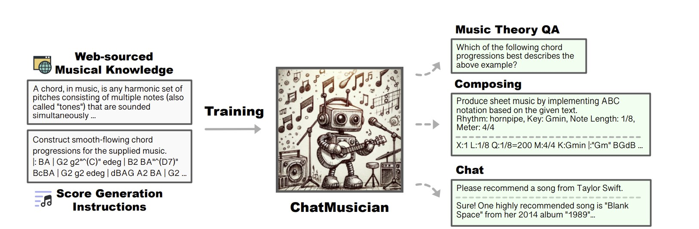

# Retrograde Chronicle of Generative Music Intelligence Evolution

##### A Compendium of Influential Works

---

## Table of Contents

  - [About](#about)
  - [License](#license)
  - [Resources](#resources)
    - [Algorithmic Composition](#algorithmic-composition)
       - [2018](#2018)
       - [2015](#2015)
       - [2009](#2009)
       - [2000](#2000)
       - [1992](#1992)
       - [1989](#1989)
       - [1959](#1959)
    - [Deep Learning Models for Symbolic Music Generation](#deep-learning-models-for-symbolic-music-generation)
      - [2024](#2024)
      - [2023](#2023)
      - [2022](#2022)
      - [2021](#2021)
      - [2020](#2020)
      - [2019](#2019)
      - [2018](#2018)
      - [2017](#2017)
      - [2016](#2016)
      - [2002](#2002)
      - [1990s](#1990s)
    - [Audio Generation](#audio-generation)
      - [2024](#2024-1)
      - [2023](#2023-1)
      - [2022](#2022-1)
      - [2021](#2021-1)
      - [2020](#2020-1)
      - [2017](#2017-1)
    - [Tokenizers](#tokenizers)
      - [2024](#2024-2)
    - [Textual Contexts & Language Model Integration](#textual-contexts--language-models-integration)
      - [2024](#2024-3)
    - [Evaluation Methodologies](#evaluation-methodologies)
      - [2023](#2023-2)
    - [General Reviews and Surveys](#general-reviews-and-surveys)
      - [2024](#2024-4)
  - [Acknowledgements](#acknowledgements)
  - [Contributing](#contributing)

## About

This repository is maintained by [Joseph Chay](https://github.com/josephchay) presenting collected comprehensive and
influential works of resources that are related to the field of music generation. 
The resources are organized in a reverse chronological order, starting from the most recent to the earliest.

## License

This repository is licensed under the [MIT License](./LICENSE).

## Resources

---

### Algorithmic Composition

#### 2018

1. The Oxford Handbook of Algorithmic Music
   - McLean, A., & Dean, R. T. (Eds.). (2018). The Oxford handbook of algorithmic music. Oxford University Press.
   
     [Book Digital Copy](https://api.pageplace.de/preview/DT0400.9780190227005_A35478151/preview-9780190227005_A35478151.pdf)

#### 2015

1. Fundamentals of Music Processing
   - Müller, M. (2015). Fundamentals of music processing: Audio, analysis, algorithms, applications. Springer.
   
     [Book Digital Copy](https://link.springer.com/book/10.1007/978-3-319-21945-5)

#### 2009

1. Paradigms of Automated Music Generation
   - Nierhaus, G. (2009). Algorithmic composition: paradigms of automated music generation. Springer Science & Business Media.
   
     [Book Digital Copy (Request)](https://link.springer.com/book/10.1007/978-3-211-75540-2)

#### 2000

1. The Algorithmic Composer
   - Cope, D. (2000). The algorithmic composer (Vol. 16). AR Editions, Inc..
   
     [Book Digital Copy (Request)](https://www.researchgate.net/publication/209436329_The_Algorithmic_Composer)

#### 1992

1. HARMONET
   - Hild, H., Feulner, J., & Menzel, W. (1992). HARMONET: A neural net for harmonizing chorales in the style of JS Bach. 
     In Advances in neural information processing systems (pp. 267-274).
   
     [Paper](https://proceedings.neurips.cc/paper/1991/file/a7aeed74714116f3b292a982238f83d2-Paper.pdf)

#### 1989

1. A connectionist approach to algorithmic composition
   - Todd, P. M. (1989). A connectionist approach to algorithmic composition. Computer Music Journal, 13(4), 27-43.
  
     [Book Digital Copy](https://abcwest.sitehost.iu.edu/pmwiki/pdf/todd.compmusic.1989.pdf)

#### 1959

1. Experimental Music
   - Westergaard, P. (1959). Experimental Music. Composition with an Electronic Computer. 
   
     [Book Digital Copy](https://ia803209.us.archive.org/21/items/experimentalmusi00hill/experimentalmusi00hill.pdf)

---

[🡹 Back to Table of Contents 🡹](#table-of-contents)

---

### Deep Learning Models for Symbolic Music Generation

#### 2024

1. JEN-1 DreamStyler
    - 
      
      

      Chen, B., Li, P., Yao, Y., & Wang, A. (2024, June 18). 
      JEN-1 DreamStyler: Customized Musical Concept Learning via Pivotal Parameters Tuning. arXiv.org. 
      
      [Paper](https://arxiv.org/abs/2406.12292) • [Samples](https://www.jenmusic.ai/research#DreamStyler)

2. Cascaded Diffusion Models
    - Wang, Z., Min, L., & Xia, G. (2024, May 16). 
      Whole-Song Hierarchical Generation of Symbolic Music Using Cascaded Diffusion Models. arXiv.org. 
    
      [Paper](https://arxiv.org/abs/2405.09901) • [GitHub and Model](https://github.com/ZZWaang/whole-song-gen) •
      [Samples](https://wholesonggen.github.io/)

3. COMPOSERX
   - 
     
      Deng, Q., Yang, Q., Yuan, R., Huang, Y., Wang, Y., Liu, X., Tian, Z., Pan, J., ... (2024, April 28). 
      ComposerX: Multi-Agent Symbolic Music Composition with LLMs. arXiv.org. 
    
      [Paper](https://arxiv.org/abs/2404.18081)

4. Non-Differentiable Rule Guided Diffusion
   - 
     
     Huang, Y., Ghatare, A., Liu, Y., Hu, Z., Zhang, Q., Sastry, C. S., Gururani, S., Oore, S., & Yue, Y. (2024, February 22). 
     Symbolic Music Generation with Non-Differentiable Rule Guided Diffusion. arXiv.org. 
     
     [Paper](https://arxiv.org/abs/2402.14285)

5. Surveys
   - Le, D., Bigo, L., Keller, M., & Herremans, D. (2024, February 27). 
     Natural Language Processing Methods for Symbolic Music Generation and Information Retrieval: a Survey. arXiv.org. 
   
     [Paper](https://arxiv.org/abs/2402.17467)

#### 2023

1. RL-Chord
   - Ji, S., Yang, X., Luo, J., & Li, J. (2023). RL-Chord: CLSTM-Based Melody Harmonization Using Deep Reinforcement Learning. 
     IEEE Transactions on Neural Networks and Learning Systems. 
   
     [Paper](https://ieeexplore.ieee.org/abstract/document/10063204)

2. FIGRARO
   - 
     
     von Rütte, D., Biggio, L., Kilcher, Y., & Hoffman, T. (2022). FIGARO: Generating Symbolic Music with Fine-Grained Artistic Control. 
     Accepted ICLR 2023. 
     
     [Paper](https://arxiv.org/pdf/2201.10936v3)

#### 2022

1. Museformer
   - Yu, B., Lu, P., Wang, R., Hu, W., Tan, X., Ye, W., ... & Liu, T. Y. (2022). 
     Museformer: Transformer with Fine-and Coarse-Grained Attention for Music Generation. NIPS 2022.
     
     [Paper](https://openreview.net/forum?id=GFiqdZOm-Ei) • [NIPS Presentation](https://nips.cc/virtual/2022/poster/54604)

2. Bar Transformer 
   - Qin, Y., Xie, H., Ding, S., Tan, B., Li, Y., Zhao, B., & Ye, M. (2022). 
     Bar transformer: a hierarchical model for learning long-term structure and generating impressive pop music. Applied Intelligence, 1-19.
   
     [Paper](https://link.springer.com/article/10.1007/s10489-022-04049-3)

3. Symphony Generation with Permutation Invariant Language Model
   - 
     
      Liu, J., Dong, Y., Cheng, Z., Zhang, X., Li, X., Yu, F., & Sun, M. (2022). 
      Symphony Generation with Permutation Invariant Language Model. 
      
      [Paper](https://arxiv.org/pdf/2205.05448) • [Code](https://github.com/symphonynet/SymphonyNet) •
      [Samples](https://symphonynet.github.io/)

4. Theme Transformer
   - 
     
     Shih, Y. J., Wu, S. L., Zalkow, F., Muller, M., & Yang, Y. H. (2022). 
     Theme Transformer: Symbolic Music Generation with Theme-Conditioned Transformer. 
     IEEE Transactions on Multimedia. 
     
     [Paper](https://arxiv.org/abs/2111.04093) • [GitHub](https://github.com/atosystem/ThemeTransformer)

#### 2021

1. Compound Word Transformer 
   - Hsiao, W. Y., Liu, J. Y., Yeh, Y. C., & Yang, Y. H. (2021, May). Compound word transformer: 
     Learning to compose full-song music over dynamic directed hypergraphs. 
     In Proceedings of the AAAI Conference on Artificial Intelligence (Vol. 35, No. 1, pp. 178-186).
   
     [Paper](https://ojs.aaai.org/index.php/AAAI/article/view/16091) •
     [GitHub](https://github.com/YatingMusic/compound-word-transformer)

2. Melody Generation from Lyrics
    - 
     
       Yu, Y., Srivastava, A., & Canales, S. (2021). Conditional lstm-gan for melody generation from lyrics. 
       ACM Transactions on Multimedia Computing, Communications, and Applications (TOMM), 17(1), 1-20.
     
      [Paper](https://dl.acm.org/doi/abs/10.1145/3424116)

3. Music Generation with Diffusion Models
   - 
     
     Mittal, G., Engel, J., Hawthorne, C., & Simon, I. (2021). 
     Symbolic music generation with diffusion models. arXiv preprint arXiv:2103.16091.
     
     [Paper](https://arxiv.org/abs/2103.16091) • [GitHub](https://github.com/magenta/symbolic-music-diffusion)

4. Reviews
   - Hernandez-Olivan, C., & Beltran, J. R. (2021). Music composition with deep learning: A review. 
     arXiv preprint arXiv:2108.12290.
   
     [Paper](https://arxiv.org/abs/2108.12290)

#### 2020

1. Pop Music Transformer
   - Huang, Y. S., & Yang, Y. H. (2020, October). Pop music transformer:
   Beat-based modeling and generation of expressive pop piano compositions. 
   In Proceedings of the 28th ACM International Conference on Multimedia (pp. 1180-1188).
   
   [Paper](https://dl.acm.org/doi/abs/10.1145/3394171.3413671) • [GitHub](https://github.com/YatingMusic/remi)

2. Controllable Polyphonic Music Generation
   - 
     
     Wang, Z., Wang, D., Zhang, Y., & Xia, G. (2020). Learning interpretable representation for controllable polyphonic music generation. 
     arXiv preprint arXiv:2008.07122.
     
     [Paper](https://arxiv.org/abs/2008.07122) • [Web](https://program.ismir2020.net/poster_5-05.html) • [Video](https://www.youtube.com/watch?v=Sb6jXP_7dtE&t=28s&ab_channel=ISMIR2020)

3. Multitrack Music Generation
   - 

      Ens, J., & Pasquier, P. (2020). Mmm: Exploring conditional multi-track music generation with the transformer. 
      arXiv preprint arXiv:2008.06048.
      
      [Paper](https://arxiv.org/abs/2008.06048) • [Web](https://jeffreyjohnens.github.io/MMM/) • [Colab](https://colab.research.google.com/drive/1xGZW3GP24HUsxnbebqfy1iCyYySQ64Vs?usp=sharing) [Github (AI Guru)](https://github.com/AI-Guru/MMM-JSB)

4. Transformer-XL
   - 
     
     Wu, X., Wang, C., & Lei, Q. (2020). Transformer-XL Based Music Generation with Multiple Sequences of Time-valued Notes. 
     arXiv preprint arXiv:2007.07244.
     
     [Paper](https://arxiv.org/abs/2007.07244)

5. Transformer VAE
   - 
     
     Jiang, J., Xia, G. G., Carlton, D. B., Anderson, C. N., & Miyakawa, R. H. (2020, May). 
     Transformer vae: A hierarchical model for structure-aware and interpretable music representation learning. 
     In ICASSP 2020-2020 IEEE International Conference on Acoustics, Speech and Signal Processing (ICASSP) (pp. 516-520). IEEE.
     
     [Paper](https://ieeexplore.ieee.org/document/9054554)

6. Deep Learning Techniques for Music Generation 
   - Briot, J. P., Hadjeres, G., & Pachet, F. (2020). Deep learning techniques for music generation (pp. 1-249). Springer.
   
     [Book Digital Copy](https://www.researchgate.net/profile/Jean-Pierre-Briot/publication/333014972_Deep_Learning_Techniques_for_Music_Generation_-_A_Survey/links/61771cb6a767a03c14b4d6f0/Deep-Learning-Techniques-for-Music-Generation-A-Survey.pdf)

7. Reviews
   - Ji, S., Luo, J., & Yang, X. (2020). A Comprehensive Survey on Deep Music Generation: Multi-level Representations, Algorithms, Evaluations, and Future Directions. arXiv preprint arXiv:2011.06801.
   
     [Paper](https://arxiv.org/abs/2011.06801)

#### 2019

1. TonicNet
   - 
     
      Peracha, O. (2019). Improving polyphonic music models with feature-rich encoding. arXiv preprint arXiv:1911.11775.
      
      [Paper](https://arxiv.org/abs/1911.11775)

2. LakhNES
   - 

      Donahue, C., Mao, H. H., Li, Y. E., Cottrell, G. W., & McAuley, J. (2019). 
      LakhNES: Improving multi-instrumental music generation with cross-domain pre-training. arXiv preprint arXiv:1907.04868.
      
      [Paper](https://arxiv.org/abs/1907.04868)

3. R-Transformer
   - 
     
      Wang, Z., Ma, Y., Liu, Z., & Tang, J. (2019). R-transformer: Recurrent neural network enhanced transformer. 
      arXiv preprint arXiv:1907.05572.
      
      [Paper](https://arxiv.org/abs/1907.05572)

4. Maia Music Generator
   - 
     
      Maia Music Generator. (2019). Maia: A New Music Generator. 
      
      [Web](https://maia.music.blog/2019/05/13/maia-a-new-music-generator/)

5. Coconet: Counterpoint by Convolution
   - 
     
      Huang, C. Z. A., Cooijmans, T., Roberts, A., Courville, A., & Eck, D. (2019). Counterpoint by convolution. 
      arXiv preprint arXiv:1903.07227.
      
      [Paper](https://arxiv.org/abs/1903.07227) • [Web](https://coconets.github.io/)

6. Reviews
   - Briot, J. P., Hadjeres, G., & Pachet, F. D. (2017). Deep learning techniques for music generation--a survey. arXiv preprint arXiv:1709.01620.
   
     [Paper](https://arxiv.org/abs/1709.01620)

#### 2018

1. Music Transformer - Google Magenta
   - 
   - 
     
      Huang, C. Z. A., Vaswani, A., Uszkoreit, J., Shazeer, N., Simon, I., Hawthorne, et al. (2018). 
      Music transformer. arXiv preprint arXiv:1809.04281.
      
      [Web](https://magenta.tensorflow.org/music-transformer) • [Paper](https://arxiv.org/pdf/1809.04281.pdf)

2. Imposing Higher-Level Structure in Polyphonic Music
   - 
     
      Lattner, S., Grachten, M., & Widmer, G. (2018). Imposing higher-level structure in polyphonic music generation using convolutional restricted boltzmann machines and constraints. 
      Journal of Creative Music Systems, 2, 1-31.
      
      [Paper](https://arxiv.org/pdf/1612.04742.pdf)

3. MusicVAE - Google Magenta
   - 
     
      Roberts, A., Engel, J., Raffel, C., Hawthorne, C., & Eck, D. (2018, July). 
      A hierarchical latent vector model for learning long-term structure in music. 
      In International Conference on Machine Learning (pp. 4364-4373). PMLR.
      
      [Code](https://github.com/tensorflow/magenta/tree/master/magenta/models/music_vae) • 
      [Google Colab](https://colab.research.google.com/notebooks/magenta/music_vae/music_vae.ipynb) • 
      [Explanation](https://medium.com/@musicvaeubcse/musicvae-understanding-of-the-googles-work-for-interpolating-two-music-sequences-621dcbfa307c)

#### 2017

1. MorpheuS
   - 
     
      Herremans, D., & Chew, E. (2017). MorpheuS: generating structured music with constrained patterns and tension. 
      IEEE Transactions on Affective Computing, 10(4), 510-523.
      
      [Paper](https://arxiv.org/pdf/1812.04832.pdf)

2. Polyphonic GAN
   - 
   - 
     
     Lee, S. G., Hwang, U., Min, S., & Yoon, S. (2017). Polyphonic music generation with sequence generative adversarial networks.
     arXiv preprint arXiv:1710.11418.
     
     [Paper](https://arxiv.org/abs/1710.11418)

3. Bachbot - Microsoft
   - 
     
     Liang, F. T., Gotham, M., Johnson, M., & Shotton, J. (2017, October). 
     Automatic Stylistic Composition of Bach Chorales with Deep LSTM. In ISMIR (pp. 449-456).
     
     [Paper](https://www.microsoft.com/en-us/research/publication/automatic-stylistic-composition-of-bach-chorales-with-deep-l)

4. MuseGAN
   - 
     
     
     
     Dong, H. W., Hsiao, W. Y., Yang, L. C., & Yang, Y. H. (2018, April). 
     Musegan: Multi-track sequential generative adversarial networks for symbolic music generation and accompaniment. 
     In Proceedings of the AAAI Conference on Artificial Intelligence (Vol. 32, No. 1).
     
     [Web](https://salu133445.github.io/musegan/) • [Paper](https://arxiv.org/pdf/1709.06298.pdf) • [GitHub](https://github.com/salu133445/musegan)

5. Composing Music with LSTM
   - 
     
     Johnson, D. D. (2017, April). Generating polyphonic music using tied parallel networks. 
     In International conference on evolutionary and biologically inspired music and art (pp. 128-143). Springer, Cham.
     
     [Paper](https://link.springer.com/chapter/10.1007/978-3-319-54770-6_10)

6. ORGAN
   - 
     
     Guimaraes, G. L., Sanchez-Lengeling, B., Outeiral, C., Farias, P. L. C., & Aspuru-Guzik, A. (2017). 
     Objective-reinforced generative adversarial networks (ORGAN) for sequence generation models. 
     arXiv preprint arXiv:1705.10843.
     
     [Paper](https://arxiv.org/abs/1705.10843)

7. MidiNet
   - 
     
     Yang, L. C., Chou, S. Y., & Yang, Y. H. (2017). MidiNet: A convolutional generative adversarial network for symbolic-domain music generation. 
     arXiv preprint arXiv:1703.10847.
     
     [Paper](https://arxiv.org/abs/1703.10847)

#### 2016

1. DeepBack
    - 
     
      Hadjeres, G., Pachet, F., & Nielsen, F. (2017, July). Deepbach: a steerable model for bach chorales generation. 
      In International Conference on Machine Learning (pp. 1362-1371). PMLR.
      
      [Web](http://www.flow-machines.com/history/projects/deepbach-polyphonic-music-generation-bach-chorales/) 
      [Paper](https://arxiv.org/pdf/1612.01010.pdf) • [Code](https://github.com/Ghadjeres/DeepBach)

2. Fine-Tuning with RL
   - 
     
     Jaques, N., Gu, S., Turner, R. E., & Eck, D. (2016). Generating music by fine-tuning recurrent neural networks with reinforcement learning.
     
     [Paper](https://research.google/pubs/pub45871/)

3. C-RNN-GAN
   - 
     
     Mogren, O. (2016). C-RNN-GAN: Continuous recurrent neural networks with adversarial training. 
     arXiv preprint arXiv:1611.09904.
     
     [Paper](https://arxiv.org/abs/1611.09904)

4. SeqGAN
   - 
     
     Yu, L., Zhang, W., Wang, J., & Yu, Y. (2017, February). 
     Seqgan: Sequence generative adversarial nets with policy gradient. In Proceedings of the AAAI conference on artificial intelligence (Vol. 31, No. 1).
     
     [Paper](https://arxiv.org/abs/1609.05473)

#### 2002

1. Temporal Structure in Music
   - Eck, D., & Schmidhuber, J. (2002, September). Finding temporal structure in music: Blues improvisation with LSTM recurrent networks. 
     In Proceedings of the 12th IEEE workshop on neural networks for signal processing (pp. 747-756). IEEE.
   
     [Paper](https://ieeexplore.ieee.org/document/1030094)

#### 1990s

1. Neural Network Music Composition
   - Mozer, M. C. (1994). Neural network music composition by prediction: Exploring the benefits of psychoacoustic constraints and multi-scale processing. Connection Science, 6(2-3), 247-280.
   
     [Paper](https://www.tandfonline.com/doi/abs/10.1080/09540099408915726)

---

[🡹 Back to Table of Contents 🡹](#table-of-contents)

---

### Audio Generation

#### 2024

1. FluxMusic
   - 

     Fei, Z., Fan, M., Yu, C., & Huang, J. (2024, September 1). 
     FLUX that Plays Music. arXiv.org. 
     
     [Paper](https://arxiv.org/abs/2409.00587) • [GitHub](https://github.com/feizc/FluxMusic)

2. Long-Form Generation with Latent Diffusion
    - 
      
    
      Evans, Z., Parker, J. D., Carr, C., Zukowski, Z., Taylor, J., & Pons, J. (2024, April 16). 
      Long-form music generation with latent diffusion. arXiv.org.
      
      [Paper](https://arxiv.org/abs/2404.10301) • [GitHub](https://github.com/Stability-AI/stable-audio-tools/) •
      [Samples](https://stability-ai.github.io/stable-audio-2-demo/) • [Dataset](https://www.kaggle.com/datasets/yamaerenay/spotify-tracks-dataset-19222021)

3. Tango 2
    - 
      
   
      Majumder, N., Hung, C., Ghosal, D., Hsu, W., Mihalcea, R., & Poria, S. (2024, April 15). 
      Tango 2: Aligning Diffusion-based Text-to-Audio Generations through Direct Preference Optimization. arXiv.org. 
      
      [Paper](https://arxiv.org/abs/2404.09956)

4. MusicHiFi
   - Zhu, G., Caceres, J., Duan, Z., & Bryan, N. J. (2024, March 15). 
     MusicHiFi: Fast High-Fidelity Stereo Vocoding. arXiv.org. 
     
     [Paper](https://arxiv.org/abs/2403.10493) • [Samples](https://musichifi.github.io/web/) •
     [Video](https://www.youtube.com/watch?v=iytPC_6OsiQ&feature=youtu.be)

#### 2023

1. Amphion
    - 
      
      Zhang, X., Xue, L., Gu, Y., Wang, Y., Li, J., He, H., ... (2023, December 15). 
      Amphion: An Open-Source Audio, Music and Speech Generation Toolkit. arXiv.org.
      
      [Paper](https://arxiv.org/search/?query=music+generation&searchtype=all&abstracts=show&order=-announced_date_first&size=50&start=400) •
      [GitHub](https://github.com/open-mmlab/Amphion)

2. Mustango
   - 
     
     Melechovsky, J., Guo, Z., Ghosal, D., Majumder, N., Herremans, D., & Poria, S. (2023, November 14). 
     Mustango: Toward Controllable Text-to-Music Generation. arXiv.org.
   
     [Paper](https://arxiv.org/abs/2311.08355) • 
     [GitHub](https://github.com/AMAAI-Lab/mustango) • 
     [Demo & Dataset](https://huggingface.co/spaces/declare-lab/mustango)

3. Music ControlNet
   - 
     
     Wu, S., Donahue, C., Watanabe, S., & Bryan, N. J. (2023, November 13).
     Music ControlNet: Multiple Time-varying Controls for Music Generation. arXiv.org. 
     
     [Paper](https://arxiv.org/abs/2311.07069) • [Sample](https://musiccontrolnet.github.io/web/) • 
     [Video](https://www.youtube.com/watch?v=QVr-S-DyccU)

4. JEN-1 Composer
    - 
      
      Yao, Y., Li, P., Chen, B., & Wang, A. (2023, October 29). JEN-1 Composer: 
      A Unified Framework for High-Fidelity Multi-Track Music Generation. arXiv.org. 
      
      [Paper](https://arxiv.org/abs/2310.19180)

5. Music Understanding LLaMA

   - 
     
     
     Liu, S., Hussain, A. S., Sun, C., & Shan, Y. (2023, August 22). 
     Music Understanding LLaMA: Advancing Text-to-Music Generation with Question Answering and Captioning. arXiv.org.
     
     [Paper](https://arxiv.org/abs/2308.11276)

6. AudioLDM2
   Liu, H., Yuan, Y., Liu, X., Mei, X., Kong, Q., Tian, Q., Wang, Y., Wang, W., Wang, Y., & Plumbley, M. D. (2023, August 10).
   AudioLDM 2: Learning Holistic Audio Generation with Self-supervised Pretraining. arXiv.org.
   
   [Paper](https://arxiv.org/abs/2308.05734) • 
   [Samples](https://audioldm.github.io/audioldm2/) • [GitHub](https://github.com/haoheliu/audioldm2)

7. JEN-1
   - 
      
     
      Li, P., Chen, B., Yao, Y., Wang, Y., Wang, A., & Wang, A. (2023, August 9). 
      JEN-1: Text-Guided Universal Music Generation with Omnidirectional Diffusion Models. arXiv.org.
      
      [Paper](https://arxiv.org/abs/2308.04729) • [Samples](https://www.jenmusic.ai/research)

8. MusiCLDM
   - 
     
      
     Chen, K., Wu, Y., Liu, H., Nezhurina, M., Berg-Kirkpatrick, T., & Dubnov, S. (2023, August 3). 
     MusicLDM: Enhancing Novelty in Text-to-Music Generation Using Beat-Synchronous Mixup Strategies. arXiv.org. 
      
     [Paper](https://arxiv.org/abs/2308.01546)

9. High-Fidelity Multi-Band Diffusion
   - 
     
     Roman, R. S., Adi, Y., Deleforge, A., Serizel, R., Synnaeve, G., & Défossez, A. (2023, August 2). 
     From Discrete Tokens to High-Fidelity Audio Using Multi-Band Diffusion. arXiv.org. 
     
     [Paper](https://arxiv.org/abs/2308.02560)

10. VALL-E-X
    - 
     
      Zhang, Z., Zhou, L., Wang, C., Chen, S., Wu, Y., Liu, S., ... & Wei, F. (2023). 
      Speak Foreign Languages with Your Own Voice: Cross-Lingual Neural Codec Language Modeling. arXiv preprint arXiv:2303.03926.
      
      [Paper](https://arxiv.org/abs/2303.03926)

11. ERNIE-Music
    - 
     
      Zhu, P., Pang, C., Wang, S., Chai, Y., Sun, Y., Tian, H., & Wu, H. (2023). 
      ERNIE-Music: Text-to-Waveform Music Generation with Diffusion Models. arXiv preprint arXiv:2302.04456.
      
      [Paper](https://arxiv.org/abs/2302.04456)

12. Multi-Source Diffusion Models
    - 
     
      Mariani, G., Tallini, I., Postolache, E., Mancusi, M., Cosmo, L., & Rodolà, E. (2023). 
      Multi-Source Diffusion Models for Simultaneous Music Generation and Separation. arXiv preprint arXiv:2302.02257.
      
      [Paper](https://arxiv.org/abs/2302.02257) • [Samples](https://gladia-research-group.github.io/multi-source-diffusion-models/)

13. SingSong
    - 

       Donahue, C., Caillon, A., Roberts, A., Manilow, E., Esling, P., Agostinelli, A., ... & Engel, J. (2023). 
       SingSong: Generating musical accompaniments from singing. arXiv preprint arXiv:2301.12662.
       
       [Paper](https://arxiv.org/abs/2301.12662) • [Samples](https://storage.googleapis.com/sing-song/index.html)

14. AudioLDM
    - 

       Liu, H., Chen, Z., Yuan, Y., Mei, X., Liu, X., Mandic, D., ... & Plumbley, M. D. (2023). 
       AudioLDM: Text-to-Audio Generation with Latent Diffusion Models. arXiv preprint arXiv:2301.12503.
       
       [Paper](https://arxiv.org/abs/2301.12503) • [Samples](https://audioldm.github.io/) • 
       [GitHub](https://github.com/haoheliu/AudioLDM)

15. Mousai
    - 
      
      
      
   
      Schneider, F., Jin, Z., & Schölkopf, B. (2023). Mo\^ usai: Text-to-Music Generation with Long-Context Latent Diffusion. 
      arXiv preprint arXiv:2301.11757.
      
      [Paper](https://arxiv.org/abs/2301.11757)

16. Make-An-Audio
    - 
     
      Huang, R., Huang, J., Yang, D., Ren, Y., Liu, L., Li, M., ... & Zhao, Z. (2023). 
      Make-An-Audio: Text-To-Audio Generation with Prompt-Enhanced Diffusion Models. arXiv preprint arXiv:2301.12661.
      
      [Paper](https://arxiv.org/abs/2301.12661) • [Samples](https://text-to-audio.github.io/)

17. Noise2Music
    - 

      Huang, Q., Park, D. S., Wang, T., Denk, T. I., Ly, A., Chen, N., ... & Han, W. (2023). 
      Noise2Music: Text-conditioned Music Generation with Diffusion Models. arXiv preprint arXiv:2302.03917.
      
      [Paper](https://arxiv.org/abs/2302.03917) • [Samples](https://google-research.github.io/noise2music/)

18. Msanii
    - 

      Maina, K. (2023). Msanii: High Fidelity Music Synthesis on a Shoestring Budget. arXiv preprint arXiv:2301.06468.
      
      [Paper](https://arxiv.org/abs/2301.06468)

19. MusicLM
    - 
     
      Agostinelli, A., Denk, T. I., Borsos, Z., Engel, J., Verzetti, M., Caillon, A., ... & Frank, C. (2023). 
      Musiclm: Generating music from text. arXiv preprint arXiv:2301.11325.
      
      [Paper](https://arxiv.org/abs/2301.11325) • [Samples](https://google-research.github.io/seanet/musiclm/examples/) 
      [Dataset](https://www.kaggle.com/datasets/googleai/musiccaps)

#### 2022

1. Musika
   - 
     

     Pasini, M., & Schlüter, J. (2022). Musika! Fast Infinite Waveform Music Generation. arXiv preprint arXiv:2208.08706.
     
     [Paper](https://arxiv.org/abs/2208.08706)

2. AudioLM
    - 

      Borsos, Z., Marinier, R., Vincent, D., Kharitonov, E., Pietquin, O., Sharifi, M., ... & Zeghidour, N. (2022). 
      Audiolm: a language modeling approach to audio generation. arXiv preprint arXiv:2209.03143.
      
      [Paper](https://arxiv.org/abs/2209.03143) • [Samples](https://google-research.github.io/seanet/audiolm/examples/)

#### 2021

1. RAVE
    - 
      
      Caillon, A., & Esling, P. (2021). RAVE: A variational autoencoder for fast and high-quality neural audio synthesis. 
      arXiv preprint arXiv:2111.05011.
      
      [Paper](https://arxiv.org/abs/2111.05011) • [GitHub](https://github.com/acids-ircam/RAVE)

#### 2020

1. Jukebox - OpenAI
   - 

      [Web](https://openai.com/blog/jukebox/) • [Paper](https://arxiv.org/abs/2005.00341) • 
      [GitHub](https://github.com/openai/jukebox/)

#### 2017

1. MuseNet - OpenAI
   - [Web](https://openai.com/blog/musenet/)

---

[🡹 Back to Table of Contents 🡹](#table-of-contents)

---

### Tokenizers

#### 2024

1. WavTokenizer
    - Ji, S., Jiang, Z., Wang, W., Chen, Y., Fang, M., Zuo, J., Yang, Q., ... (2024, August 29). 
      WavTokenizer: an Efficient Acoustic Discrete Codec Tokenizer for Audio Language Modeling. arXiv.org. 
    
      [Paper](https://arxiv.org/abs/2408.16532) • [GitHub](https://github.com/jishengpeng/WavTokenizer)

---

[🡹 Back to Table of Contents 🡹](#table-of-contents)

---

### Textual Contexts / Language Models Integration

#### 2024

1. SongCompoer
   - 

     Ding, S., Liu, Z., Dong, X., Zhang, P., Qian, R., He, C., Lin, D., & Wang, J. (2024, February 27). 
     SongComposer: A Large Language Model for Lyric and Melody Composition in Song Generation. arXiv.org. 
   
     [Paper](https://arxiv.org/abs/2402.17645)

2. ChatMusician
    - 
      
    
      Yuan, R., Lin, H., Wang, Y., Tian, Z., Wu, S., Shen, T., Zhang, G., Wu, Y., Liu, C., Zhou, Z., ... (2024, February 25). 
      ChatMusician: Understanding and Generating Music Intrinsically with LLM. arXiv.org. 
      
      [Paper](https://arxiv.org/abs/2402.16153)

3. MusicAgent - Microsoft
   - 
     
     
     

     Yu, D., Song, K., Lu, P., He, T., Tan, X., Ye, W., Zhang, S., & Bian, J. (2023, October 18). 
     MusicAgent: An AI Agent for Music Understanding and Generation with Large Language Models. arXiv.org. 
     
     [Paper](https://arxiv.org/abs/2310.11954)

4. MusiLingo
    - 

      Deng, Z., Ma, Y., Liu, Y., Guo, R., Zhang, G., Chen, W., Huang, W., & Benetos, E. (2023, September 15). 
      MusiLingo: Bridging Music and Text with Pre-trained Language Models for Music Captioning and Query Response. arXiv.org. 
      
      [Paper](https://arxiv.org/abs/2309.08730) • [GitHub](https://github.com/zihaod/MusiLingo) • 
      [Dataset](https://huggingface.co/datasets/m-a-p/Music-Instruct/tree/main) 

---

[🡹 Back to Table of Contents 🡹](#table-of-contents)

---

### Evaluation Methodologies

#### 2023

1. Metrics
   - Gui, A., Gamper, H., Braun, S., & Emmanouilidou, D. (2023, November 2). 
     Adapting Frechet Audio Distance for Generative Music Evaluation. arXiv.org. 
   
     [Paper](https://arxiv.org/abs/2311.01616)

2. Surveys
   - 
     
     Xiong, Z., Wang, W., Yu, J., Lin, Y., & Wang, Z. (2023, August 26). 
     A Comprehensive Survey for Evaluation Methodologies of AI-Generated Music. arXiv.org. 
     
     [Paper](https://arxiv.org/abs/2308.13736)

---

[🡹 Back to Table of Contents 🡹](#table-of-contents)

---

### General Reviews and Surveys

#### 2024

1. Applications and Advances of Artificial Intelligence in Music Generation: A Review
    - Chen, Y., Huang, L., & Gou, T. (2024b, September 3). 
      Applications and Advances of Artificial Intelligence in Music Generation:A Review. arXiv.org. 
    
      [Paper](https://www.arxiv.org/abs/2409.03715)

---

[🡹 Back to Table of Contents 🡹](#table-of-contents)

---

## Acknowledgements

### Reviews and Surveys

#### 2021

1.  Music Composition with Deep Learning
    - Hernandez-Olivan, C., & Beltran, J. R. (2021, August 27). Music Composition with Deep Learning: A Review. arXiv.org. 
    
      [Paper](https://arxiv.org/pdf/2108.12290)

## Contributing

Check out the [Contribution Guidelines](CONTRIBUTING.md).

If you find any missing resources or would like to contribute to this repository, please feel free to open an issue or a pull request.
